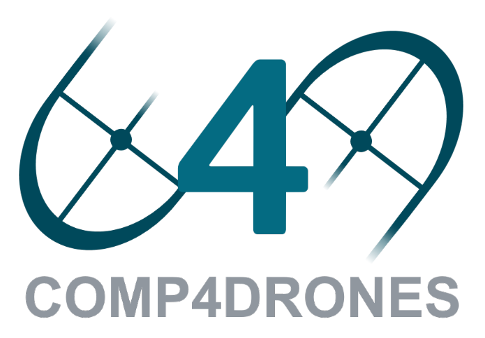

[COMP4DRONES](https://www.comp4drones.eu/) is an ECSEL JU project coordinated by Indra that brings together a consortium of 49 partners with the aim of providing a framework of key enabling technologies for safe and autonomous drones. It brings to bear a holistically designed ecosystem from application to electronic components, realized as a tightly integrated multi-vendor and compositional UAV embedded architecture solution and a tool chain complementing the compositional architecture principles. The project will mainly focus on the following objectives:

- Ease **the integration and customization** of embedded drone systems.
- Enable drones to take **safe autonomous decisions**.
- Ensure the deployment of **trusted communications**.
- Minimize the **design and verification effort** for complex drone applications.
- Ensuring **sustainable impact** and creation of an industry-driven community.

Demonstration and validation activities are essential to ensure the quality and relevance of innovations. COMP4DRONES will ease the development of new application and functionalities on the fields of transport, construction, surveillance and inspection, logistics, and agriculture

