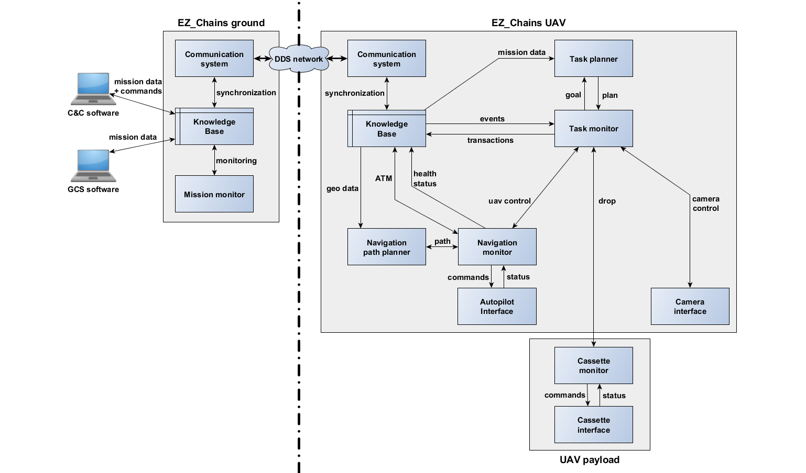

# EZ_Chains Fleet Architecture

- __ID:__ WP3-16
- __Contributor:__ SCALIAN
- __Owner:__ SCALIAN
- __Licence:__ Proprietary
- __expected TRL:__ 8
- __KET:__ 1.1.7 Operations management, 2.1.1 Intelligent Mission Management, 2.2.3 Planning and Scheduling, 2.2.4 Fail-safe Mission, 2.5.1 Drone and Rover, 2.5.2 Swarm formation and cooperation
- __Contact:__ david.cherel@scalian.com

EZ_Chains is an architecture designed for fleet of UAS so they can autonomously perform cooperativ tasks to achieve complex operations.

EZ_Chains is a generic architecutre that combines different components to achieve autonomous fleet behaviour. This genericty allows to use heterogeneous UAS and alloxate them different missions. For instance, EZ_Chains is used in the [Metis project](https://www.ep.total.com/en/innovations/research-development/metis-integrated-geophysical-acquisition-system-quality-real-time) for the UC3 D1: the goal is to use a fleet of five UAS to autonmoously drop seismic sensor over a large area. In addition to the dropping UAS, a surveillance UAS is used to detect potential intruders on the operation areas, preventing dropping operations to increase the safety of the system.

The figure below demonstrates the main category of components that build EZ_Chains:

On a more technical aspect, EZ_Chains relies on a centralised knowledge base that allows distributed (embedded) decision making. The architecture is composed of hierarchical components: there is a decision layer to provide plans to the monitoring/execution layer that uses the interface layer to control the robot and its payload.

The modules composing EZ_Chains:

 - The **knowledge base** provides a view of the fleet situation and the mission evolution in a SQL database. It also triggers notifications for each fleet/mission event. Through its API, each agent of the fleet (UAV, GCS, C&C, etc.) is able to declare critical information, to book shared resources, to send orders or instructions to other agents, etc. It uses the communication system to ensure that the state is correctly synchronized among the fleet.
 - The **task monitor** is the central node of EZ_Chains. This module sends requests to all the other modules in order to perform actions. The task monitor communicates its planned moves and actions to the fleet by sending transactions to the knowledge base that are transmitted to the fleet thanks to the communication system. The task monitor is also listening to the fleet/mission events triggered by the knowledge base in order to detect conflicts with its initial plan.
 - The **task planner** receives request from the task monitor to compute the best plan (that is, the best sequence of actions) in order to achieve a goal (e.g. drop six DARTs). To do its computation, the task planner reads the knowledge base to get the current status of the mission.
 - The **navigation monitor** is in charge of the UAV navigation. It complies with the task monitor queries (e.g. take-off, move to, hold position, etc.). This module ensures the safety of the UAV by doing air traffic management, collision detection, and forbidden areas avoidance.
 - The **navigation path planner** is used by the navigation monitor to compute an efficient path to reach a destination, avoiding the forbidden areas, using the corridors if needed and avoiding potential conflicts with the path of other UAVs.
 - The **autopilot interface** provides the low level services to control the UAV behavior. It receives the instructions from the navigation monitor and reports the UAV status to it.
 - In the figure, two payload interfaces are depicted that are related to the mission carried out by the system. There are used to accomplish the Logistics use-case (UC3 – Demo 1), where sensors have to be dropped. Hence there are three sub-modules:
   * The **camera interface** provides the low level services to control the camera behavior and its gimbal. It receives the commands from the task monitor.
   * The **cassette monitor** is running on the cassette controller and is connected to the task monitor through a network connection between the cassette and the drone. On a dropper UAV, the cassette provides services related to the dropping of DARTs, but any kind of payload could be handled.
   * The **cassette interface** provides the low level services to manage the cassette sensors and actuators. It receives the instructions from the cassette monitor and reports the cassette status to it.
 - The _ground version_ of 'EZ_Chains', also called _black box_ embeds the communication system and the knowledge to allow the GCS and the C&C to define the mission and to interact with the fleet. EZ_Chains ground also embeds a tiny **mission monitor** module doing some checks about the fleet and the mission evolution.
