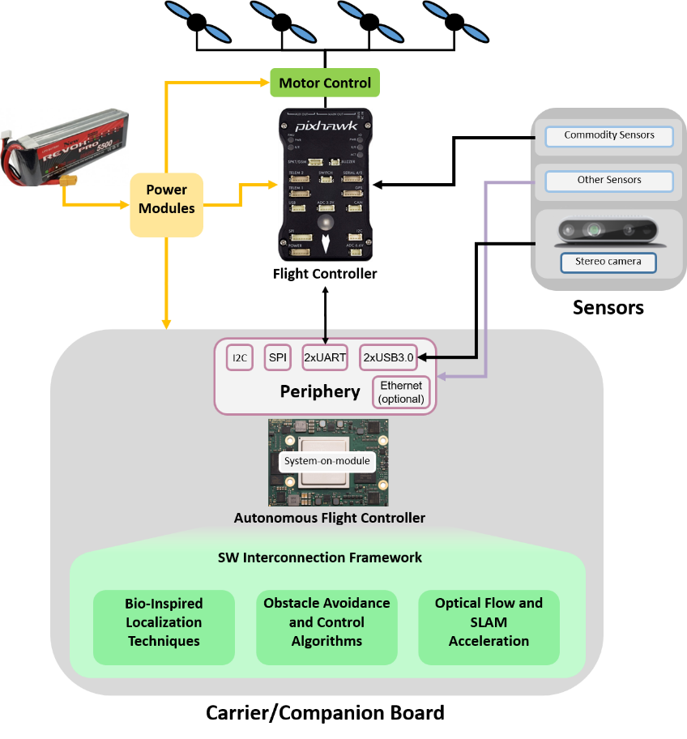
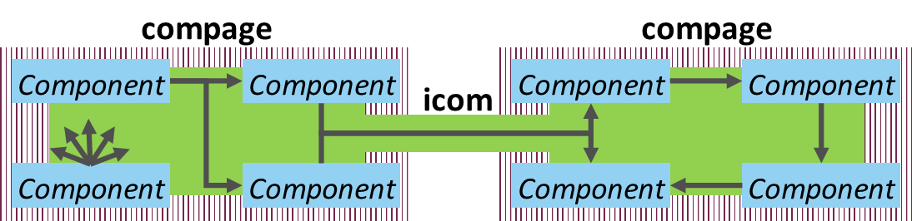

# Modular SoC-based embedded reference architecture

The currently available embedded drone flight controllers and computational platforms are based on a sequential processing paradigm, which is a limitation to the drone's onboard computational capacity. Modern heterogeneous systems that incorporate different computational paradigms (MPU, FPGA, GPU) promise advantages of great computational capabilities and even better power efficiency with a drawback of greater system complexity. In the COMP4DRONES project, we will utilize our experience in heterogeneous SoC systems to develop an SoC-based embedded reference architecture, which would be the core of the autonomous flight controller.

This reference architecture will include a methodology on the algorithm separation between concurrent (digital logic) and sequential processing paradigms, a framework for managing and reusing different software components of the application and component intercommunication framework, including zero data copy communication.

Main characteristics:
Management of software and hardware components.
Distribution of algorithms across heterogeneous processing paradigms.
Novel approaches to sensing and processing pipelines.

Usage in practice:
Access to the developed software / hardware stacks.
Access to the documentation and methodologies.
Integration of different software and hardware components onto EDI indoor drone.

