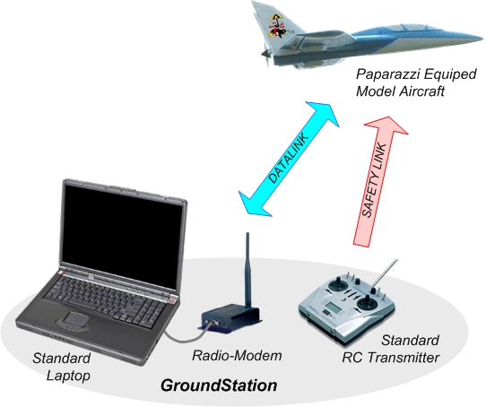
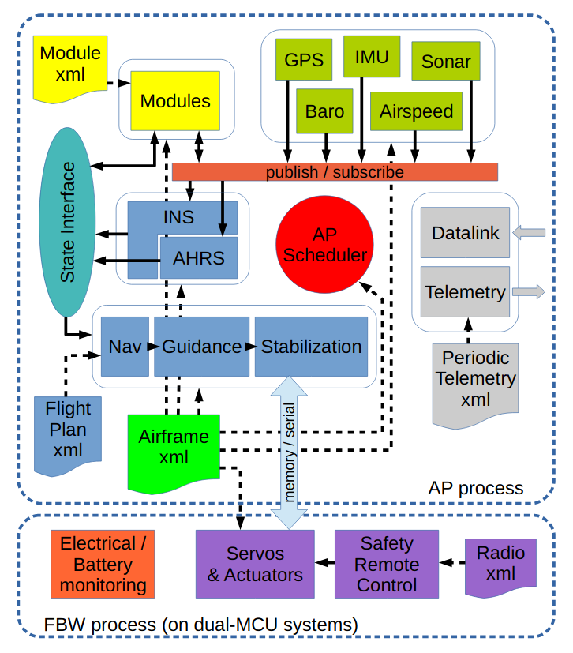

# Paparazzi UAV

Paparazzi is a complete system of open source hardware and software for Unmanned Aircraft Systems (UAS), including both the airborne autopilot as well as complete ground station mission planning and monitoring software utilizing a bi-directional datalink for telemetry and control.

Paparazzi has been created at ENAC in 2003, and is now supported by other institutes such as MAVLAB of the TU-Delft, individual developers, and some private UAV companies from several countries.

The Paparazzi system was initially designed for robust small fixed-wing aircrafts in 2003, but it now support several other configurations and concepts such as high-aspect ratio gliders, multi-rotors, transitioning vehicles, and rovers. Today, Paparazzi flies on 16cm Quark up to 4.3 meter spanned Adler UAV from University of Stuttgart. The popular UAV platform Bebop2 from Parrot2 can also be used to run the Paparazzi software.

# Overview

Figure 1

 

The global view of the system (see figure 1) is very typical of UAV systems:

- Ground segment: all the ground software and hardware infrastructures that are used to prepare, monitor and analyze the flight.
- Airborne segment: the aircraft, its hardware parts including payload and all the embedded software to control the flight (from stabilization to decision making).
- Communication segment: defines all the communication links and protocols between the ground and airborne segments.
- Safety link: safety remote control that can be separated from the ground station for short range direct control.

# System architecture

Figure 2

 

The Paparazzi system architecture is show in Figure 3. The UAV (in blue) is navigating
autonomously and is monitored and controlled from the ground (in brown). The ground
control station (GCS), or GCS agent, provides a graphical user interface with telemetry
data received by the link agent which manages the ground-based radio modem. The link
agent distributes telemetry data across the network (a single computer, a local network
or the internet) where it can be used locally or remotely by the: (1) server - an agent that
logs, distributes, and preprocesses these messages for the GCS and other agents; (2)
messages - a real-time numeric display of all telemetry data; (3) a number of other useful
agents. These agents are:

- a GCS-based flight plan editor to modify waypoints
- a UAV simulator to test flight plans and code modifications
- a real-time plotter for graphical telemetry data visualization
- a log plotter for graphical telemetry visualization after a flight

All of these processes run simultaneously and each module is independently launched
and can be configured via the Paparazzi Center.

Communication with the autopilot is based on a custom protocol and message definition, called Pprzlink. Libraries exist for airborne and ground segments, in multiple languages (C, OCaml, Python), and for multiple transport protocols (Serial, UDP, Ivy). On the ground segment, ground control station uses Pprzlink with the Ivy transport. Ivy is a software publish/subscribe bus based on UDP or TCP to exchange text messages.
There are four ways to extend Paparazzi functionalities:

- Using Pprzlink with the current ground station tools
- Using Pprzlink independently of the ground station tools
- Adding a dedicated board on the drone and using Pprzlink to communicate directly with the autopilot (usually with the serial transport)
- Adding a module to the autopilot itself

A combination of these options can be used at the same time to achieve specific goals.

## Using Pprzlink with the ground station

The easier way to interact with Paparazzi is to create a new agent as part of the ground station. All parameters and configuration files are easily accessible, making it easy to interact with the drone or display new data on the GCS. As example, the Interactive Informatics team of ENAC used it to design novel human-drone interactions for safety pilots and adaptable interactions for pilots with disabilities. 

## Using Pprzlink without the ground station

It is also possible to use Pprzlink on the ground by interacting directly with the datalink. This approach gives less high-level services but makes it simpler to exchange custom messages.

## Adding a dedicated board on the drone

Custom dedicated boards (Raspberry or Arduino for instance) can be integrated in the drone and interact with the autopilot through a local link, typically a serial interface between the dedicated board and the autopilot. The type of interaction is the same than with a ground agent. 

## Adding a module to the autopilot itself

The modularity of the airborne architecture (see Figure 3) also enables users to write custom modules that will run on the autopilot itself. All sensors data, payload or actuators are then available to this module. Modules are the building blocks of the airborne architecture. These modules can do various things such as handling a specific sensor connected to the autopilot, enhance navigation capabilities, implement custom stabilization or guidance control loops...

Figure 3

 

Paparazzi also has a simulator based on [JSBSim](http://www.jsbsim.org). The autopilot can be built for both the hardware target and the simulator target. The simulator then uses the same code that will run on the real hardware. Custom modules that use platform specific capabilities must provide alternative code in order to be built for another target, such as the simulator.

