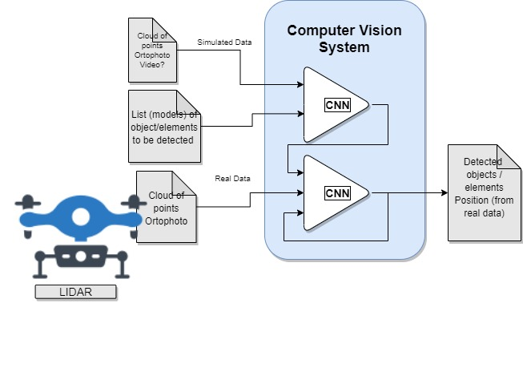

# Computer Vision Components for drones

AI system built upon deep learning techniques in order to improve the way of interpreting surroundings and detecting scenarios from data captured with drones

AI system built upon automatic algorithms for the autodetection/geo-referencing of road elements and taking cloud of points generated by a LIDAR sensor. 

Accelerate the Constructive Process of a Civil Infrastructure.

