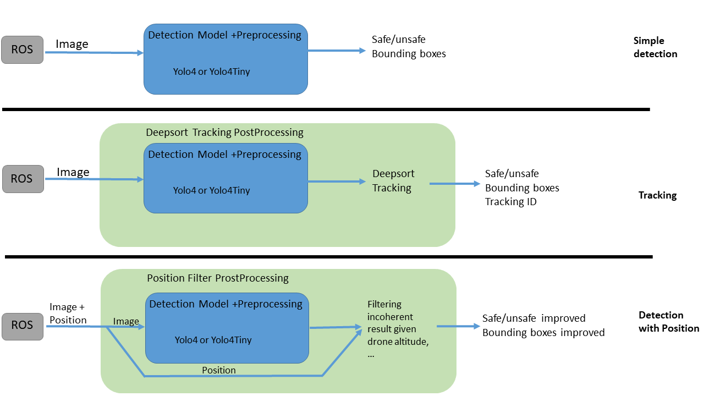

# EZ_Chains Clearance

- __ID:__ WP4-5
- __Contributor:__ SCALIAN
- __Owner:__ SCALIAN
- __Licence:__ Proprietary
- __expected TRL:__ 6
- __KET:__ 2.2.7 Obstacle Detection and Avoindance, 2.4.1 Data fusion and processing, 3.1.2 Passive Optical
- __Contact:__ david.cherel@scalian.com or mathieu.damour@scalian.com

This module aims at providing an automatic method for person detection, vehicles and animals able to do real time analysis of video feeds while embedded on a drone. It is mainly used in the UC3 D1, where a fleet of UAS are dropping sensors. The component returns the respective position in the image of the detected elements and if an element is detected the dropping operation is aborted.

The component takes input both from RGB and thermal cameras, the camera can be set in Nadir or oblique view. Since the view point is different, the detection will use different trained models.

The component is developped using Tensorflow and Keras for the deep learning. In order to allow real-time detect, a VPU is added to the UAS onboard companion computer. We are using an Intel Neural Compute Stick 2 (NCS2) with the OpenVino framework. Not all instructions available in Tensorflow and Keras can be found in this framework, so some of the operations are kept on the companion computer.

The figure below presents the different pipelines available, allowing different detection and outputs:

In order to be more generic the component has been develop in the form of a training framework: it is easier to train the system for a new use-case. In order to demonstrate this feature, the component has been trained to detect vehicules on road:

_N.B.: This model has been not been properly trained, it jsut servesas a demonstrator of the new framework capabilities._