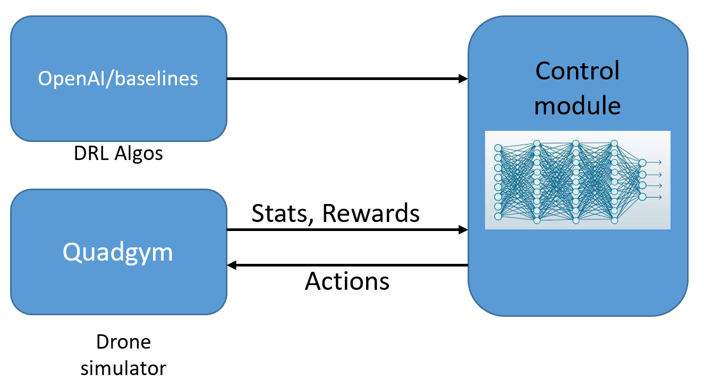

# EZ_Chains AI Stabilization

- __ID:__ WP4-42
- __Contributor:__ SCALIAN
- __Owner:__ SCALIAN
- __Licence:__ Proprietary
- __expected TRL:__ 4
- __KET:__ 1.1.6 Command and control, 2.4.1 Data fusion and processing
- __Contact:__ david.cherel@scalian.com

Scalian has experimented with using Deep Reinforcement Learning (DRL) to stabilise UAS flight. The goal is to experiment with the robustness this solution could offer.

We train and test our algorithms on a complex drone model. In addition, we take into account the measurement noise and the introduction of disturbances, to test the robustness of the DRL algorithms.

To test DRL algorithms, we use the "OpenAI Baselines" API available in open-source on GitHub. This API comes with a set of ready-to-use DRL algorithms. It allows researchers to test and improve DRL algorithms on their projects without needing to redevelop everything from scratch.

DRL algorithms are generally implemented on simulators developed in a test environment provided by OpenAI. This simulation environment is called “Gym”. The developers of OpenAI as well as contributors in this community have provided researchers with "Gym"-based simulators for different types of dynamic systems such as the inverted pendulum, the autonomous car, and the drone. These simulators also allow visualization of the behavior of these dynamic systems on a graphical interface while testing DRL algorithms to allow researchers to assess their results. In our work, we used a drone simulator, quadgym, developed in the "Gym" environment and based on a more complex mathematical model than the models mentioned in the state of the art. 

The simulations have shown promising results, so the next step would be to deploy these methods on real drones to assess the quality of these approaches and achieve complete autonomy with as few errors as possible.
