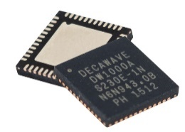
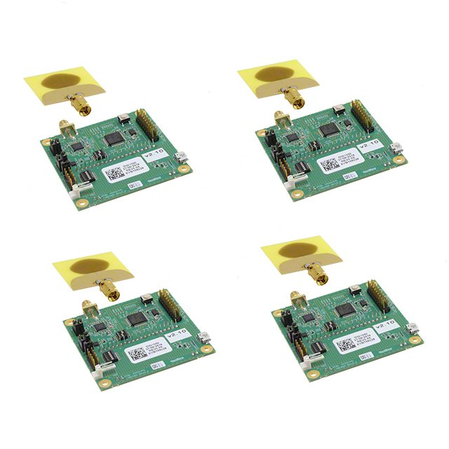

WP3-15_1

# UWB based indoor positioning

- __ID:__ WP3-15_1
- __Contributor:__ ACCORDE
- __Owner:__ 
- __Licence:__
- __expected TRL:__
- __KET:__
- __Contact:__

Decawave based indoor positioning module

IPS objectives directly related to IPS platform elements
Cost-effective solution, Easy to deploy, Flexible, Versatile, Real-Time 
Solution:
Custom design by ACORDE:

- UWB
- processing+storage+configuration capabilities

Preliminary Evaluation
Tests with evaluation board of the radio chipset ongoing

