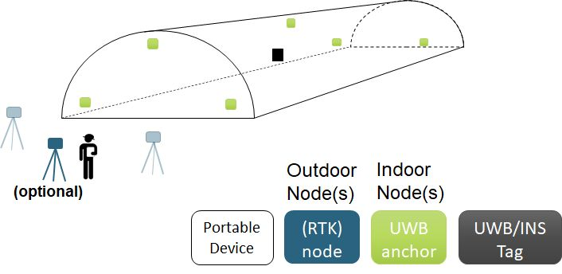
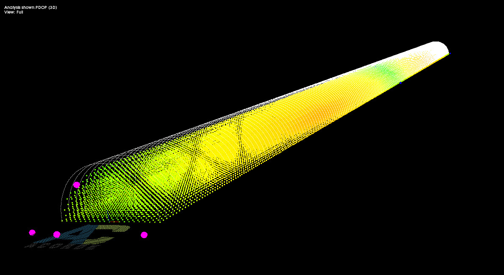

# UWB based indoor positioning

- __ID:__ WP3-15_1, WP4-17, WP5-19
- __Contributor:__ ACORDE
- __Owner:__  ACORDE
- __Licence:__ Private
- __expected TRL:__ 4
- __KET:__ Indoor Positioning
- __Contact:__ fernando.herrera@acorde.com

The UltraWideband Indoor Positioning Solution (IPS) of ACORDE will allow an accurate real-time geo-positioning solution within long indoor infrastructures, like tunnels.

__Solution:__

The solution consist of a deployment of anchor devices along the indoor infrastructure. Some of them can be fixed, while others can be temporally installed for better accuracy and coverage, i.e. for enabling accurate real-time positioning to a digitization drone flying at specific time slots (e.g., once a week) for Building Information Model (BIM), as required in the  construction scenario posed in COMP4DRONES.

Out of the infrastructure, at least one external node is used to propagate geo-referencing to both the moving tag and inner anchors.
The moving tag fuses UWB-enabled ranges together with its own sensed data (IMU) for smooth, higher data rate position provision to the tag.

__Improvements:__ 

ACORDE IPS presents several distinctive and innovative aspects.
ACORDE IPS solution is specifically designed for providing accurate 3D positioning to a single tag.
This is crucial for the scenario posed in C4D, where a digitization drone will need safely and accurately navigate within the indoor infrastructure.

ACORDE IPS solution considers the challenges coming for positioning on the posed scenario. 
Long indoor infrastructures pose geometries challenging for beacon based positioning, to ensure accuracy and, at the same time, a cost-effective solution. In addition, the posed solution considers obstacles coming from the own geometry and objects within the infrastructure (e.g. machines).

As the digitization scenario is expected to happen at a limited time slot of the indoor infrastructure operation (e.g., 1h a week), ACORDE IPS solution is designed in C4D to be flexible so that it can be reconfigured to provide suited multi-tag positioning and communication services (e.g. for workers, machines) out of the digitization slot (the design of this part is out of C4D scope).

__Custom Design and Innovation:__

ACORDE IPS is relying on a custom design of tags and anchors by ACORDE, to support the cost-effective and flexible approach. 

A novel control access media and application level algorithms to support positioning in the challenged environment are being developed.

Moreover, the IPS solution of ACORDE is complemented by a tooling (IPS-MAF) also developed in COMP4DRONES which enables the design of the most effective and efficient deployment.

The image below shows a simulation of the dilution of precision suffered for a simple anchor deployment in a simple geometry tunnel. The simulation has been done and visualized with IPS-MAF.
It shows that if no care is put on the design of the deployment, accounting geometrical aspects, large *degraded accuracy* areas easily appear.

IPS-MAF is being extended to support this modelling and moreover, other aspects like realistic (and more challenging) geometries, UWB sensor ranges, and static obstacles. 

For user comfortability, ACORDE IPS solution enables auto-positioning of inner anchors at initialization. At the same time, the solution is flexible to allow the explicit configuration of anchors geo-positioning, to let improve tag position accuracy.

__Interfaces:__

TBC (images of HW interfaces, flavour of SW interfaces)
