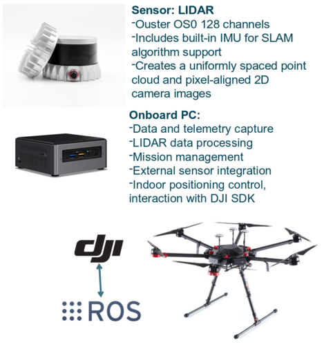

WP3-30

# Multi-sensor positioning

- Storage of the raw data from the LIDAR that provide the environment point cloud
- Detect obstacles by preventing flight to these obstacles 
- Mapping of the surrounding environment
- Precision of the navigation in real time less than 1m
- Integration in ROS operating system, together with the DJI SDK (http://wiki.ros.org/dji_sdk)
- High level control in order to autonomously navigate in the indoor environment 

