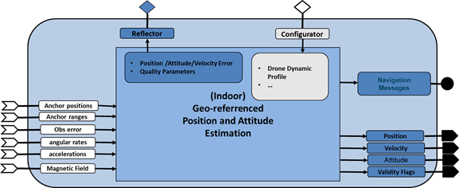
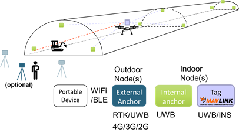
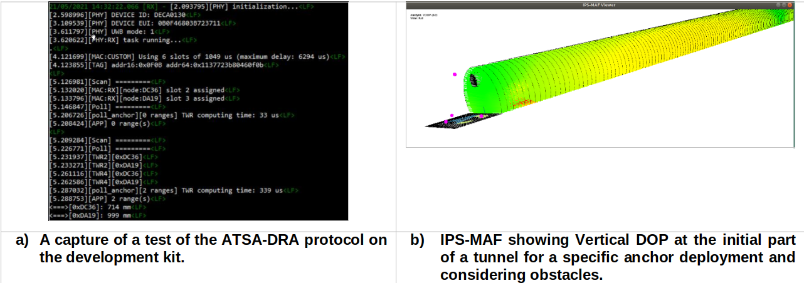
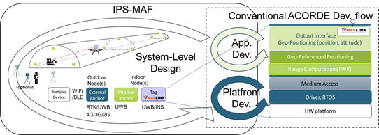

# WP3-15_1 - UWB based indoor positioning

|||
|-|-|
|ID|WP3-15_1|
|Contributor|ACORDE|
|Levels|Platform, Function|
|Require|Energy, Raw sensed data from UWB transceiver and IMU|
|Provide|Navigation Sensor|
|Input|Raw sensed data from UWB transceiver and low-cost INS|
|Output|Position (main focus), attitude|
|C4D building block|UWB-based indoor positioning system|
|TRL|4|

  
Figure 61: Overall UWB-based indoor positioning system block (as reported in D2.3)

## Detailed Description

In COMP4DRONES, ACORDE is developing an Indoor Positioning System (IPS), a solution for the challenges posed by the construction use case, demo tunnel (UC2-demo 2). ACORDE IPS corresponds to the building block in section 6.3.1 of D3.2 [24]. ACORDE IPS is specifically oriented to serve reliable and precise geo-referenced position to a drone flying on a tunnel under construction, in charge of the capture of raw data for tunnel digitization, to be employed for Building Information Modelling (BIM) [25]. The objective of the ACORDE IPS is two-fold, i.e., to ensure a safe navigation along a planned path, and to optimize the accuracy of the navigation data (and of raw UWB ranges) synchronized with the thermography or LIDAR capture so that it can be exploited in the offline digitalization process associated to the BIM.
The specific environment and the usage scenario posed by the construction stakeholder (ACCIONA) and the drone integrator&operator (FADA-CATEC), configures a set of constraints in terms of cost of the solution, power consumption, size, weight, and precision (reported in [26]and [27]) which, added to the specific geometry of the indoor infrastructure, has leaded ACORDE to a novel and improved IPS solution. ACORDE IPS solution was first introduced in [28]. Here it is briefly overviewed and represented in Figure 62 (update of Fig.42 in [28]) for reader convenience. It is based on mounting a “tag node” on the indoor drone, in order to measure distances to a set of strategically deployed “anchor nodes”, called ranges. The tag will rely on an INS sensor for providing a processed tag position. In addition, the tag can also provide range data (if required). A standard Mavlink interface supports the provision of these data to the drone navigation system.

  
Figure 62: Indoor Positioning System developed by ACORDE

The posed solution contributes improvements and innovations accounting the scenario and the current state of the art (as explained in section 1.2). The solution is also “complete” in the sense that ACORDE covers the design&implementation of the solution (anchor&tags platforms and their firmware). Moreover, ACORDE has also improved its design flow by developing the IPS-MAF tool. All this activity, comprised by technical packages WP3-WP6, can be summarized as follows:

- Design and implementation of anchor and tag platforms (including the required board support package (BSP) (WP3-15_2).
- Design and implementation of anchor and tag firmware, including the configuration, positioning algorithms and interfacing (WP4-17).
- Ensuring a robust and enriched communication among anchors, and among the tag (within the drone) and the anchors, for a more robust and improved positioning (WP5-19-ACO).
- Developing an Indoor Positioning System Modelling and Analysis Framework (IPS-MAF) for indoor structures, specifically tunnels (WP6).
- Providing at the tag a Mavlink [29] interface to support providing both processed positioning information, and “pre-processed” information (ranges) (WP3, WP4, and WP5).

## Current Status

Up to the report date, ACORDE has advanced in parallel in all the afore mentioned tasks. The current advance can be summarized as follows:

- For anchor and tag platform design, ACORDE has already decided the ranging technology, i.e., Ultrawideband (UWB), and the module sustaining the implementation (DW1000 from Qorvo [DW1K]). ACORDE has also evaluated the basic performance of this technology, after acquiring an evaluation kit. Moreover, ACORDE has already decided on main components of the anchor and tag architectures (e.g., microcontrolers), and provisioning them (which has turned out to be critical during these COVID’19 times).
- Related to application design, ACORDE checked code available with acquired evaluation kit and its unsuitability for the posed use case. ACORDE has been already able to start to develop and test modified trilateration algorithms for anchors autopositioning and tag positioning on top of IPS-MAF simulations. 
- The assessment, implementation and basic test of a novel and improved Medium Access Control (MAC) and ranging protocol for single-tag scenario has been also performed. 
- A former version of IPS-MAF supporting static and simulation-based analysis is ready.
- A Mavlink library ready for supporting the tag to provide position is ready. A Mavlink extension is also proposed for enabling the tag providing the ranges.
This is allowing ACORDE tackling the final design and implementation of the anchor&tag platforms, firmware implementation and validation (according to the plan in [D1.2]).

## Contribution and Improvements

The stakeholder (ACCIONA) described the digitization scenario at a specific time slot where the construction 7days/24hours activity stopped for 1-2hours. At that time, it is possible to lie some “mobile” anchors, together with the “fixed” anchors, and later let the drone perform a pre-programmed digitization flight, where the tunnel under-construction can present some eventual obstacles (e.g., machines, signals). The posed scenario presents several challenges, many of them specific in relation to other existing real-time location systems:

- The specific long geometry of tunnel (which challenges UWB ranges, cost of the solution and the validity of conventional trilateration algorithms).
- Providing features for a flexible and agile anchor deployment, which does not oblige surveyors to geo-positioning all anchors, especially mobile ones. 
- Need to provide real-time, 3D geo-referenced positioning on the tag (while most solutions focus on 2D relative positioning, commonly computed on a ground platform which centralizes data from anchors).
- Cost and energy/power optimization (the latter important for fixed anchors)
- Need for system-level design tooling. The IPS is a complex system with many parameters and aspects (specific deployment, transmission powers, sensitivities, latencies of the ranging phases, algorithmic alternatives, etc) with potential significant impact on the overall performance. Means for facilitating a holistic design, accounting for those many different aspects at early design stage are required even for experienced designers in the field.

The same scenario also presented the opportunity to exploit the fact that during digitization flight only one drone, i.e., one tag needs to be serviced. The question is how to exploit this single-tag assumption for a safer flight and better digitalization. 

  
Figure 63: Some results at the current status of ACORDE IPS system Development.

The ACORDE solution tackles these challenges and opportunities. So far, a number of contributions in comparison to other existing solutions are highlighted:

- Customized, cost-effective anchor and tag platforms, specifically designed to cope with the computational needs (specially for tag) and energy/power efficiency needs (specially anchors).
- Novel MAC protocol called Asynchronous Tag trigger, Slotted Anchor response with Deterministic and Random Allocation (ATSA-DRA), specifically adapted to the single-tag assumption, that ensures deterministic latency, while optimizing the number of anchors in view. This protocol has been already implemented and formerly tested on the evaluation kit as reported in [30].
- At application level, the solution enables geo-referenced, real-time 3D positioning. Moreover, the application overcomes the challenges of the tunnel geometry. A modified trilateration algorithm has been already developed which enables positioning in regions of limited anchors visibility (coverage) and poor dilution of precision (DOP), where a conventional least-squares based approach is not working. This is specifically required for enabling anchors auto-positioning at the initial phase.
- The development of IPS-MAF, is a qualitative step on ACORDE capabilities for tackling custom design of IPS systems for long indoor infrastructures (tunnels, mines, large pipes, …). It enables a newer system-level design flow (as explained later). It is remarkable that IPS-MAF already served to detect the afore mentioned issues on the usage of conventional least-squares algorithms, and to design and test the modified trilateration algorithm, even before the anchor or tag platforms are ready. IPS-MAF reveals not straightforward outcomes, e.g., notice the “coverage” pattern and the “shadow” provoked by obstacles in Figure 63b. 
- The support of a Mavlink interface at the tag side, to provide both completely processed (e.g., position data) and partially processed (e.g., ranges). The latter enable the offering ACORDE IPS as a complementary positioning sub-system, which integrators can fuse with other alternative technologies. Moreover, ranges transfer is a “smooth” (in the form of dialect) Mavlink extension contributed by ACORDE in COMP4DRONES [30].

## Design and Implementation

ACORDE IPS development was started in COMP4DRONES, motivated by the needs of the stakeholder (ACCIONA) and drone integrator (FADA-CATEC), by relying on the expertise of ACORDE on outdoor positioning, and on embedded HW and SW development. The statement of the solution requirements and the wish list from the stakeholder and the drone integrator, made early evident that a more holistic, model-based design was required. It motivated the development of the IPS-MAF, which, as shown in Figure 64, can be now used at early design stage to build up a holistic model of the IPS system. IPS-MAF can be used to analyse and decide key aspect at different levels of system (deployment of the anchors, sensitivities and transmission powers, transmission frequencies, etc) while keeping a holistic view of the system.

  
Figure 64: IPS-MAF provides a qualitative step towards a holistic, model-based design of Indoor Positioning Solutions for long infrastructures

That is, IPS-MAF enables a holistic model of the IPS, while integrating some actual pieces of the application, so in that sense it also enables to advance some part of the application development. Therefore IPS-MAF feeds the conventional platform development and embedded application development phases, where ACORDE has already long expertise. At the same time, the measurement and characterizations done for platform and application development serve to feedback and polish the holistic model. Summing up, an extended system-level design flow has been enabled, after coupling IPS-MAF to conventional ACORDE development processes for platform development (which includes PCB design, mechanical design, drivers’ development, embedded application development) and application development (where ACORDE typically develops in C/C++, relying on a GUI based (typically Eclipse), microcontroller specific cross-development environment.

