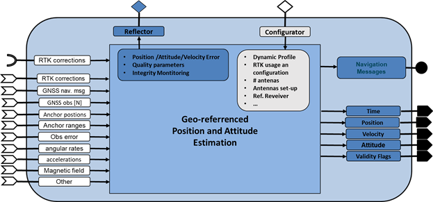
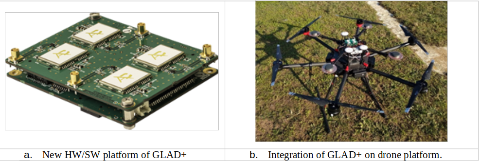
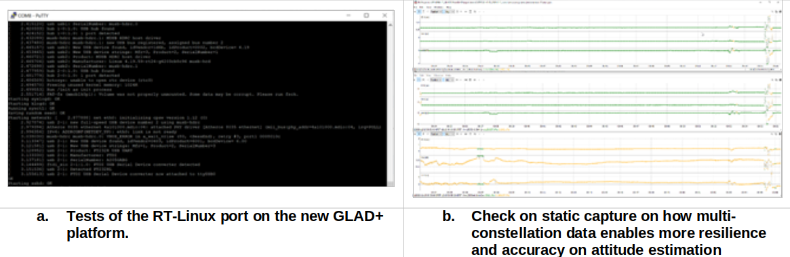
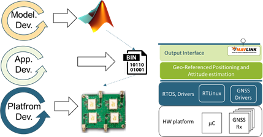
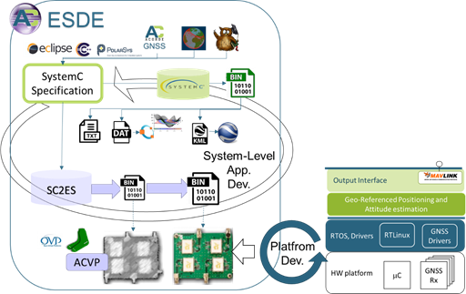

# WP3-15_2 Geo-referenced Position and Attitude Estimation

|||
|-|-|
|ID|WP3-15_2|
|Contributor|ACORDE|
|Levels|Platform, Function|
|Require|Energy, Raw sensed data navigation messages of GNSS receivers, raw data from low-cost IMU and barometer.|
|Provide|Navigation Sensor|
|Input|Raw sensed data from UWB transceiver and low-cost INS|
|Output|Position (main focus), attitude|
|C4D building block|Geo-referenced Position and Attitude Estimation System|
|TRL|5|

  
Figure 65: Geo-referenced Position and Attitude Estimation system block (as reported in D2.3)

## Detailed Description

In COMP4DRONES, ACORDE is developing GLAD+, and outdoor geo-referencing system which abides to the “Geo-referenced Positioning and Attitude estimation system” block introduced in the COMP4DRONES architecture introduced (section 8.11 of D3.2 [24]), and whose representation is reproduced in Figure 65 for convenience. GLAD+ is an improved version of its predecessor GLAD (GNSS-based Low-Cost position and Attitude Determination system). Section 1.2 sums up the contributions and improvements brought by COMP4DRONES with respect to GLAD.
GLAD+ is specifically oriented to provide drones quality navigation information (position, velocity and attitude) at a reduced cost in challenged outdoor scenarios. Drone scenarios expose position/attitude estimation systems to challenging conditions (e.g., shadows, more challenging dynamics than land-vehicles, calibration constraints), and stringent cost, size and weight requirements, as the ones reported in [26] and [27]. As GLAD, GLAD+ is a “complete” solution from ACORDE, in the sense that ACORDE performs both application and platform design and development (including a COTS based HW design). In addition to a significant upgrade of its positioning products, in COMP4DRONES ACORDE is also aiming the improvement of its productivity on the modelling, design, implementation and validation procedures of these type of systems.

ACORDE is tackling the design and development of GLAD+, and the improvement of the related design flow in different parallel activities:

- The design of and improved HW/SW platform for the navigation solutions (WP3-15_1). It includes a new HW platform with improved capabilities on GNSS receivers, and also the assessment of license-free real-time RTOS on top.
- Enhancement of the navigation software, for adapting it to the new platform and to apply algorithmic improvements, including the assessment of possible AI based improvements (WP4-16).
- Providing support of anti-jamming and anti-spoofing features (WP5-11-ACO).
- Providing an improved/extended interface for a smoother integration on drone systems (activity globally associated to WP3, with implications in WP4 and WP5).

## Current status

So far, ACORDE has advanced in parallel in all the afore mentioned tasks. The current advance can be summarized as follows:

- The new HW platform for GLAD+ has been designed and implemented (shown in Figure 66a). The new HW platform includes new low-cost GNSS receivers, with multi-constellation and anti-jamming and anti-spoofing capabilities.
- A custom Linux Real-Time port for the GLAD+ HW platform has been developed. This port relies on an updated u-boot, on buildroot-2020.02-LTS (generating a filesystem to be loaded as ramdisk), and on kernel-rt-4.19.59 (includes RT-PREEMT patch).
- In past GLAD development, a platform abstraction layer was developed in order to separate platform dependent code (e.g., threads creation, interruption management, POSIX calls, call to drivers). This layer has been already updated to cover RT-Linux target.
- A preliminary version of the driver for making available jamming and spoofing events has been already developed and tested.
- A logger system has been updated and sent together the GLAD+ HW/SW platform ACORDE to the drone integrator in construction use case (UC2-demo1). ACORDE generated documentation for integration and supported the integrator in what resulted a smooth and quick integration.
- The integrator performed flight tests. ACORDE supported the integrator with additional documentation (i.e., for operation and tests of the integration, and for indicating specific maneuvers to let validation tests cover as many working conditions as possible). 
- With that information, ACORDE has done some preliminary evaluation of the current algorithms, and tested the potential of some improvements, i.e.., multi-constellation support. Algorithmic improvement is in progress.

  
Figure 66: New HW/SW platform for the ACORDE outdoor geo-referencing system and integration on a drone platform int he COMP4DRONES for the outdoor demo of the construction use case

## Contribution and Improvements

GLAD+ is expected to bring important improvements or contributions that can be summarized as follows:

- __More interoperability__, given by the support of a Mavlink interface for providing the position estimates. 
- __Security features__, enabled by the anti-jamming and anti-spoofing capabilities
- __Lesser cost__, a validated Linux-based port implementation means an important license cost saving with regard GLAD implementation.
- __Better performance__ (higher resilience, precision, and integrity) of the positioning solution (including attitude).
- A proposal of __smooth Mavlink extension__ to provide all attitude components, and to report jamming and spoofing events.

Figure 67a) shows the boot of the custom RT Linux distribution developed by ACORDE for GLAD+ platform. As can be seen, the kernel boots in little bit more 3 seconds (time labels are relative to kernel start). Taking into account the bootloader (not shown in the capture) took around4-5s, it leads to ~8s for booting the position&attitude estimation application (actually, the boot process goes on to get Ethernet link ready and launching SSH services, however, they are used for configuration or debugging, and the position&attitude application is launched before triggering). Further tests were conducted. Different resolution timers (from 100 to 1000 Hz) were tested. Moreover, the latencies of the scheduler (context switches) were estimated under heavy workload conditions, relying on the “cyclictest” [31] and “hackbench” [32] standard Linux utilities. An average latency 41 us, with 72 us maximum latency was obtained. This is a key figure for tick timer setting. For instance, 20 context-switches per second would take 1.4ms max. overhead, and less than 1ms on average, which seems affordable for GLAD+ application margins. Further study with final GLAD+ firmware is still required though.

  
Figure 67: Some results of the activity on design and development of GLAD+ in COMP4DRONES

Figure 67b) shows the results of some preliminary analysis enabled by the data log from the integration tests of Dec. 2020. That test was performed in static conditions in front of the facilities of the integrator (FADA-CATEC). Specifically, Figure 67b) shows three stacked graphics with the three components of a “tail-head” baseline estimation, fundamental pre-processing for attitude estimation (heading and pitch components can be directly derived via a simple formula). The top one is a non-causal estimate, and thus only possible after offline post-processing, which is taken as a ground truth reference. Green colors reflect convergence of the ambiguity resolution algorithms (and thus resembles a precise estimate), while orange reflect no-convergence, and thus no-valid, in general, inaccurate estimate. The bottom graphic shows a “forward” (i.e., that can be computed in real-time) estimate of the baseline using only GPS constellation. As can be seen, most of the capture (97.9%) lacks convergence. The problem is related to the buildings around the drone at the capture time, which shadowed several satellites of the GPS constellation. The graphic on the middle, shows a forward estimate of the baseline using both GPS and Galileo constellations, as enabled by the GLAD+ HW/SW platform. This estimate gets the same 97.7% figure, but of convergence time, indeed very close to the 98.3% time achieved with non-causal processing.

## Design and Implementation

As well as the significant improvements regarding GLAD, which are leading to a new improved low-cost geo-referenced position&attitude estimation system, i.e., GLAD+, in COMP4DRONES, ACORDE is making progress towards a qualitative enhancement of its design procedures. This piece of work is in direct relation to WP6 activities.

  
Figure 68: Design flow followed by ACORDE for its outdoor geo-referenced position&attitude estimation systems 

Figure 68 shows the development methodology that ACORDE is applying for its georeferenced outdoor positioning systems. The methodology is relatively conventional in its two bottom layers. ACORDE has long expertise in platform development, which includes PCB design, mechanical design, drivers’ development. ACORDE also has experience on embedded application development. GLAD, and so GLAD+ were and are developed in C/C++, on a microcontroller targeted cross-development environment, and relying on a GUI based environment (Visual Studio or Eclipse). On top of these two layers, ACORDE develops and tries different versions of the positioning algorithms by using a Matlab model. This model is fed with raw data logged on captures taken on integration tests and real flights. Additional Matlab scripts serve to test and compare output results.

This approach has proven to be useful and enables model building/refinement relying on raw sensor data logged at past captures. However, it has also some important disadvantages. One of them is associated to the conventional, sequential HW/SW development. HW platform design and implementation comes before driver development or RTOS port (if required). In turn, HW/SW platform availability is a pre-condition for application development. Once the application is ready, it is possible to evaluate if the performance (timing, memory, energy and power consumption, etc) and validate it.  As well as the long latencies involved, the flow adds the risk of late finding of performance bottlenecks that involve a drastic re-design, of hardware in the worst case. To these drawbacks, we need to add the high cost of translation of Matlab models to C/C++ implementation, and the traceability problems generated at the validation time.

In COMP4DRONES, ACORDE is developing and evaluating a newer approach to overcome those drawbacks. It is sketched in Figure 69. The ESDE framework developed in WP6 [33], is encrusted in at a top level layer, for a system-level approach to embedded software design and development, to encompass the conventional HW/SW platform development capabilities and processes of ACORDE.

  
Figure 69: System-level methodology for the design and implementation of outdoor geo-referenced position&attitude estimation systems in COMP4DRONES

Some key aspects of the ESDE flow for productivity improvement are:

- The fast functional models that can be built at the top lever, able to significantly speed-up functional validation vs Matlab model execution.
- The automated embedded software generation mechanisms that avoid a significant translation effort from the system model to the implementation C/C++ code.
- The possibility to parallelize of the development of firmware (binary or object file), or very close version of it with HW development, by relying on a high-fidelity virtual platform.
- The possibility to validate firmware (without availability of the physical platform), eventually using several virtual platforms for test parallelization
    
More details on ESDE are reported on WP6 reports.

