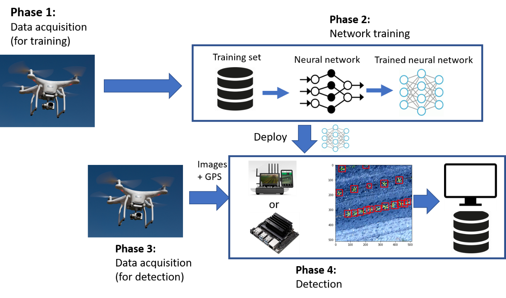
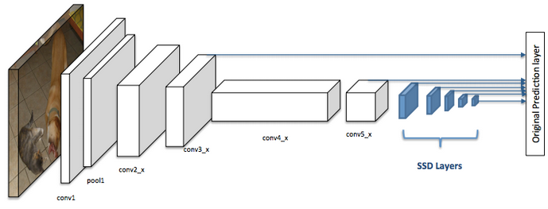

# WP3-37 - Video and data analytics

|||
|-|-|
|ID|WP3-37|
|Contributor|Aitek|
|Levels|System|
|Require|On board camera processing units with sufficient resources|
|Provide|Object detection |
|Input|Video flows|
|Output|Images and video flows (both with bounding box to highlight target detected), metadata (es. JSON files which describe the detected information), alarms, other information|
|C4D building block|Perception|
|TRL|5|

## Detailed Description

Video analytics component (WP3-37) is a software module that implements video analysis algorithms based on Deep Learning approaches. It will be used to process RGB (mainly) and infrared (eventually) images. 
This block is deputy to analyse image collected by onboard camera in order to extract relevant information, description/understanding of what has happened or what is happening. One of the most common tasks is object detection, that consists in recognizing the presence of a person or a specific object in an image, also detecting its position. Video analytics for object detection consists of the following four steps, as reported in Figure 88. While training phase is done offline, obviously not on the drone, the final steps, the real detection, can be done in real-time or in post processing and can be done on board or on the ground segment.

  
Figure 88: Steps in detecting objects from video

## Contribution and Improvements

Neural network optimization needed to simplify its complexity. In this way computational requirements can be relaxed and therefore such networks can be deployed also on low-power edge devices. A proper training phase is needed according to the application requirements. In particular, this component will be part of Use Case 5, and therefore will be adapted to be used in the context of the smart agriculture for plants detection.

## Design and Implementation

Further details about this component are reported in this section. Targets are detected analysing each video frame as an individual image. The adopted technique is known as SSD (Single Shot Detector) in which the detection is done in a single stage (a single shot). Such approach is faster and simpler compared with other ones like RPNs (Regional Proposal Networks) that require at least two shots to perform the same task. In Figure 89 is reported the structure of an SSD.

  
Figure 89: Structure of a Single Shot Detector

The main characteristics of an SSD are reported here below:

- __Single Shot:__ this means that the tasks of object localization and classification are done in a single forward pass of the network
- __Detector:__ The network is an object detector that also classifies those detected objects
- __Grid:__ an SSD divides the image using a grid and have each grid cell be responsible for detecting objects in that region of the image.
- __Priors:__ each grid cell in SSD can be assigned with multiple anchor/prior boxes. These anchor boxes are pre-defined and each one is responsible for a size and shape within a grid cell

