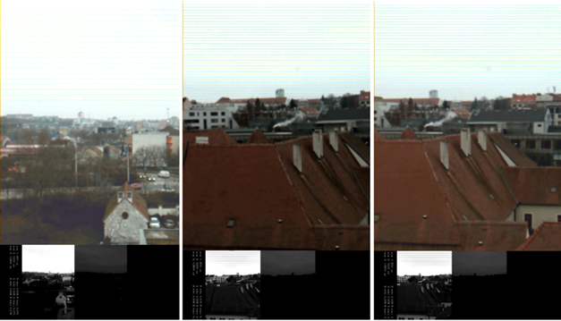

# WP3-03 - Sensor information algorithms

|||
|-|-|
|ID|WP3-03|
|Contributor|BUT|
|Levels|Functional|
|Require|Payload data (drone images)|
|Provide|Tone mapped HDR video as Axi4 Video Stream|
|Input|RGB images captured by drone (Payload data)|
|Output|RGB images processed by component (HDR tone mapped images)|
|C4D building block|(Video) Data Analytics|
|TRL|4|

## Detailed Description

HDR is part of image processing that focuses on capturing, processing, and displaying images with a High Dynamic Range. Its primary goal is to achieve reproduction of the captured scene on digital devices. HDR (HDR) for single images is deeply studied topic (although it is still quite opened). HDR can be obtained using specialized HDR sensors, or using standard sensors by acquisition of image sequence with different exposure times. These images can be captured simultaneously e.g. through beam splitter on several CCD/CMOS sensors  or more often sequentially. HDR can be obtained using specialized HDR sensors, or using standard sensors by acquisition of image sequence with different exposure times. These images can be captured simultaneously e.g. through beam splitter on several CCD/CMOS or more often sequentially (merging/fusion of exposures). With the advent of HDR video capturing new problems arose. Application of TMO without careful consideration of temporal coherence between consecutive frames may lead to adverse effects. Video tone mapping methods needs to carefully consider temporal coherence to preserve this temporal character, for example during fast luminance changes. 
In the C4D project BUT is improving HDR video tone mapping FPGA IP core. The design is based on programmable hardware tightly connected to an "embedded" processor (FPGA SoC Xilinx Zynq, but may also be implemented on other platforms with FPGA). It covers all functionality: reading data from a camera sensor, merging multiple images with alternating exposures into HDR images/HDR video and applying HDR tone mapping. The system can be extended with other functions (software, hardware or FPGA IP core) such as HDR video compression, image pre-processing, exposure control, and the “ghost-free” function removes possible artifacts caused by the movement of objects in the programmable hardware. This block provides acquired data in HDR or tone mapped format and can be extended with other data analytics tools/algorithms (e.g., detectors).
In the C4D reference architecture context, this block supports data acquisition for further processing either in the FPGA or in the following systems. Sensor information algorithms is part of payload management – data acquisition block, and component provides inputs to the   data management block (i.e., payload data analytics).

## Contribution and Improvements

BUT is implementing and improving sensor data processing algorithms which include software and firmware for FPGA. This involves video processing algorithms (for example HDR algorithms). HDR multi-exposure fusion algorithm to be implemented in the drone, possibly also implementing tone mapping and/or ghost removal in order to "feed" further image and video processing subsystems in the drone by image information with high dynamic range. 
BUT increased performance of the algorithms, which reduce latency and increase throughput (currently IP core can process up to 200 mega pixels per second). Robustness of the controller with respect to environmental disturbances and increased resiliency. This improvement will be based on increased robustness of the video processing with respect to HDR while keeping the processing means and extent of video processing "unchanged" thanks to the tone mapping that virtually brings the "same image format" as in usual processing.

## Design and Implementation

Component is divided into four main blocks (each block can be use independently):

1. Sensor data acquisition
2. Buffering
3. HDR Merging and deghosting
4. HDR Tone Mapping

__Sensor data acquisition__  
Architecture is based on Xilinx Zynq platform which is connected to Python 2000 CMOS sensor using LVDS (Low-voltage differential signaling) interface. The CMOS output consists of a raw CFA (Color Filter Array) image data with a Bayer filter mosaic.

__Buffering__  
The raw image is stored to DDR memory using DMA and double buffering to avoid overwriting of the data. For DDR write one DMA is used. For reading image data 3 DMAs are used. 

__HDR Merging and deghosting__  
The HDR merge block reads three image streams simultaneously through the DMAs. First, it applies inverse camera response function to obtain image with linear response and merge HDR image. The merging algorithm performs per-pixel processing and requires a relatively small number of per-pixel operations. Some of its functionality is computationally demanding (e.g. division and Gauss function calculation), however, it can be optimised and/or tabulated. The Gaussian function used for ghosting suppression can be convenient because the pixel values are discrete and only a finite combination of pixel values is possible.

__HDR Tone Mapping__  
HDR pipeline is implemented in FPGA and pipelined at 200MHz while processing one pixel per clock. Input of Tone mapping block is 18bit CFA  pixel in 10.8 fixed-point (FP) representation (10 integer and 4 fractional bits) and output is RGB pixel in <0,1> interval. Algorithm is based on Durand and Dorsey tone mapping operator. Durand operator is originally two pass algorithms, because it requires extreme values of the base layer. Implementation of multi-pass image processing algorithm in FPGA is problematic because of limited memory size. Typically, there is not enough space to store whole image directly in FPGA. In our case we need to compute only minimum and maximum value (or percentiles) of the base layer and we selected approach where minimum and maximum value is used from previous frame.

  
Figure 35: Example of HDR processing during test flight. Top images contain tone mapped images, bottom images show LDR images used for merging and tone mapping

