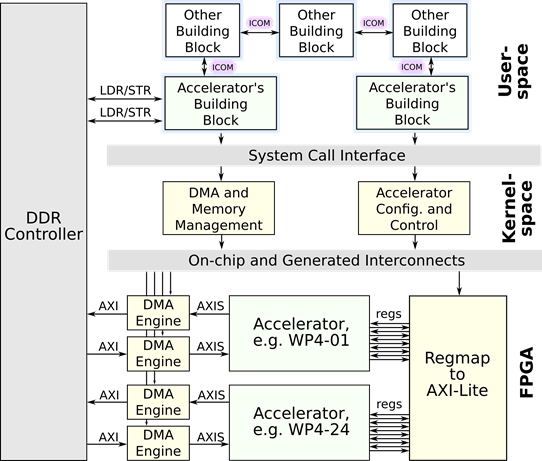
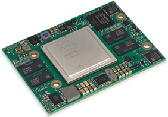

# WP3-02 - Modular SoC-based embedded reference architecture

|||
|-|-|
|ID|WP3-02|
|Contributor|EDI|
|Levels|System|
|Require|Specification of the architecture, D3.2|
|Provide|Heterogeneous (FPGA + MPU) platform for carrying out computationally demanding algorithms on a drone|
|Input|HW accelerators and SW implementation of the core drone building blocks, i.e. for perception, actuation, flight planning, guidance and control, health and payload management, communication, data management and mission management.|
|Output|Energy efficient medium (SoM with a carrier board) and supporting software infrastructure for deploying multitude of autonomous flight control architectures.|
|C4D building block||N/A, i.e. reference architecture|
|TRL|5|

  
Figure 33: Internal system architecture of the Modular SoC-based embedded reference architecture

## Detailed Description

Core enablers for reducing energy consumption and enabling mobile computing are System-on-Chip (SoC) and their extension Heterogeneous System-on-Chip (HSoC) technologies. The currently available embedded flight controller platforms mostly use the sequential processing paradigm, which is a limiting factor for the drone’s onboard computational capacity. Our objective is to improve the SoA drone capabilities by using modern HSoCs, which reduce energy consumption and accelerate computationally intensive algorithms, e.g. localization based on visual SLAM. We focus on employing HSoCs that combine Field Programmable Gate Arrays (FPGA) and processor computing paradigms within a single chip. Hence MPU can be used for providing a high-level control and for processing non-localized (requiring intense scatter-gather data access) algorithms, while FPGA is dedicated to processing pipelines and tasks requiring parallel and/or determined execution.
In the C4D project, EDI designs and contributes a Modular SoC-based embedded reference architecture that includes the following hardware and software components:

+ __MPSoC-based autonomous flight controller hardware__, including a Zynq UltraScale+ ZU15EG System on Module (SoM) from Trenz Electronics with a custom carrier board tailored for use with midsize drones.
+ __FPGA vendor-agnostic IP cores__ for standardized communication with the accelerators and their run-time configuration.
+ __Linux modules__ for Direct Memory Access (DMA) engine control, virtual memory management, accessing accelerator configuration and providing user-space API.
+ __System architecture frameworks__ for implementing component-based software architectures and ensuring appropriate inter-communication mechanism, i.e. inside process, between systems, zero data copy.

## Contribution and Improvements

EDI is designing a specialized carrier board PCB for the Ultrascale+ SoMs from Trenz, shown in Figure 34. The design involves exposing standard connectivity such as SPI, I2C, UART, QSPI for MMC as well as high-speed buses – USB2.0 and USB3.0. The reference platform is intended for but not limited to mid-sized drones. Further iterations should bring the size of the computing platform even drones of smaller indoor-type.

  
Figure 34: Core component of the reference platform – Trenz Ultrascale+ SoM

During the project, EDI plans to utilize the platform to deploy and validate the developed localization component - Hardware-accelerated Optical flow and SLAM (WP4-01) – and, hopefully, accelerators developed by other partners. The FPGA portion of the design utilizes standardized interfaces and vendor-agnostic DMA engines, which enable the unification of the driver modules (for high-performance HSoCs supplied by Xilinx or Intel).
Another improvement is the system architecture implementation tools – compage1 (for component-based software management) and icom2 (for inter-component communication), both of which were originally developed under the PRYSTINE project (G.A. 783190) for high-performance controllers in autonomous cars, and during the C4D project, functionalities are extended for supporting drones.

## Design and Implementation

As the PCB design has not yet been finalized (at the writing of this document, the components are selected, the circuit is done but the efforts are directed towards the actual placement & routing and spatial requirement considerations), the other software and hardware (FPGA) related work is being done using prototyping platforms, i.e. Xilinx ZCU102 Ultrascale+ MPSoC. The on-chip system architecture, shown in Figure 33, represents the hardware and software portions of the MPSoC package, i.e. FPGA, kernel-space and user-space. 
At the hardware level, the selected communication interface for data exchange is based on the Direct Memory Access (DMA) engines, as it offloads MPU and is best suited for high data throughput [15]. The DMA engines utilize the standard AXI4 interface, which ensures compatibility with a collection of high-bandwidth cores. Although Figure 33 follows a shared memory model [16], the FPGA may also utilize dedicated FPGA DDR memory, as long as quick access to the data is not required by the software. DMA engine serves as a translator from AXI4 memory mapped to AXIS streaming interface, which is suited for pipelined data-driven circuits, i.e. accelerators. The configuration of the accelerators is achieved by exposing I/Os of the internal registers. A block “Regmap to AXI-Lite” translates access into a memory-mapped protocol, which further is used to interface with the MPU portion of the system. The handoff information to the software is passed in a standardized way (especially for ARM-based SoCs) – by utilizing Device Tree Blob (DTB) format.
The autonomous flight controller runs a Linux operating system which assumes the incorporation of hardware abstraction mechanisms, most notably memory virtualization. These complexities are handled by Linux kernel modules that provide a user-space interface for DMA control and accelerator configuration. Notably, the memory virtualization mechanism results in a scattered physical layout of the memory. One option is to use scatter-gather memory access capabilities of the DMA engine. Nevertheless, this involves the creation of transaction descriptor tables (often a linked list) and additional memory access requests from another bus master apart from the MPU. We utilize kernel’s Contiguous Memory Allocator [17] (CMA) feature, which marks the physical memory region and manages its run-time swaps whenever a new allocation takes place. The user space is supplied with a malloc-like interface, which handles memory management and contiguous page mapping.
The user-space application follows a blackboard programming pattern [18], which is well-suited for research work. We provide two low-footprint open-source frameworks for the implementation of system architectures, the aforementioned compage and icom. Compage stores component configuration information in a separate Executable Linked Format (ELF) file segment, which provides a modular addition of new components (threads or processes). It also provides an INI-based file for configuring and replicating the software components. Icom, on the other hand, provides inter-component communication. It supports multiple communication paradigms (PUB-SUB, REQ-REP, PUSH-PULL) and can use the most appropriate communication mechanism (sockets, FIFO, message queues, etc.) depending on the communicating component location (distinct machines, same machine or same memory space).

