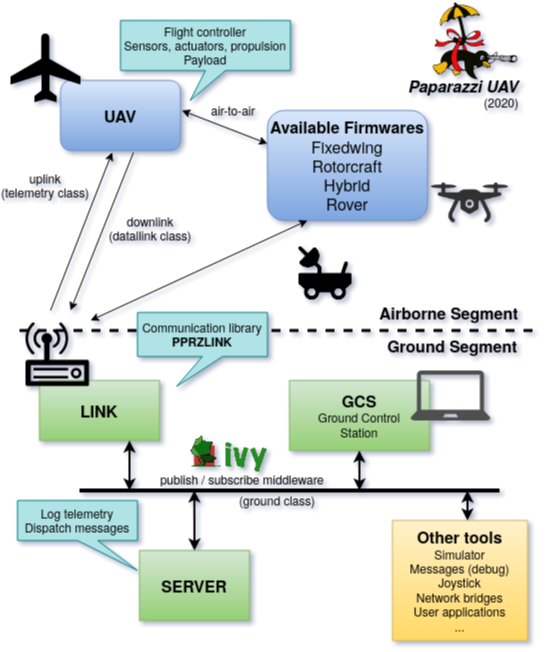
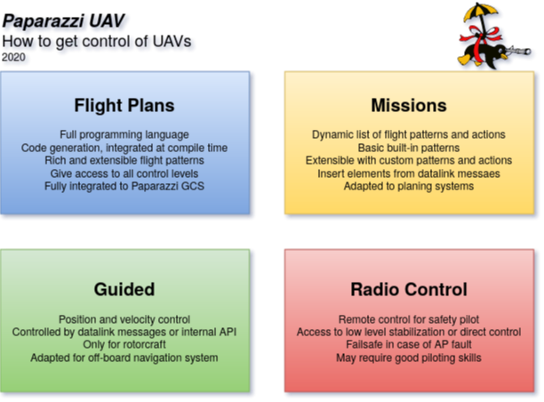
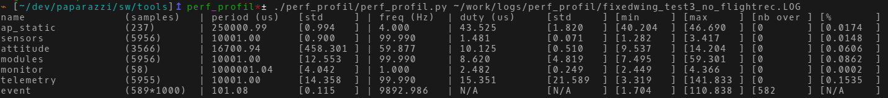
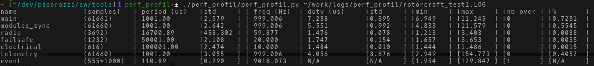
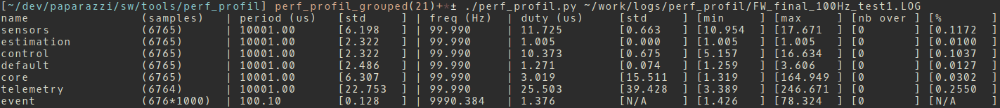
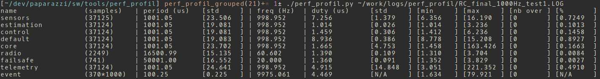

# WP3-13 - Paparazzi UAV

|||
|-|-|
|ID|WP3-13|
|Contributor|ENAC|
|Levels|Platform|
|Require|C2LINK or Flight Plan definition|
|Provide|Modular and flexible UAV autopilot system for testing and operation |
|Input|Depending on the flight mode: - flight plan definition,  - mission sequence from datalink,  - position/speed from datalink,  - low-level remote control|
|Output|Stabilized aircraft (fixedwing, multicopter, hybrid) on a given trajectory or attitude|
|C4D building block|Flight control, Actuation, + parts of Perception and Communication|
|TRL|4 to 6|

## Current status

Paparazzi is a complete system of open source hardware and software for Unmanned Aircraft Systems (UAS), including both the airborne autopilot as well as complete ground station mission planning and monitoring software utilizing a bi-directional datalink for telemetry and control.
Paparazzi has been created at ENAC in 2003, and is now supported by other institutes such as MAVLAB of the TU-Delft, individual developers, and some private UAV companies from several countries.

The Paparazzi system was initially designed for robust small fixed-wing aircrafts in 2003, but it now supports several other configurations and concepts such as high-aspect ratio gliders, multi-rotors, transitioning vehicles, and rovers.
The communication between the software blocks running on the ground and the airborne autopilot is based on the PPRZLINK library, which provides API in C/C++, Python and OCaml. 

  
Figure 46: Paparazzi communication architecture

  
Figure 47: Control options for Paparazzi UAVs

See the [Wiki](http://wiki.paparazziuav.org/wiki/Main_Page) and the [Github repository](https://github.com/paparazzi/paparazzi/).

## Contribution and Improvements

Several improvements are intended in the scope of C4D projects.

- Improvement of the internal airborne code organization: a detailed analysis of the timing between the elements of the embedded software have led to a new definition of the internal tasks’ groups. A particular attention has been given to the timing between the tasks and functions to provide a stable and reliable end-to-end execution time.
- Explicit definition of the dependencies between modules, both at functional and logic level: it allows to simplify the configuration of an aircraft (only relevant high-level modules needs to be specified), the dependency solver will include all the required modules. The overall system is also more robust as it can detect circular dependencies, conflicts and missing functionalities.
- Improvements of the static scheduling for the telemetry messages to spread the link loading over time and avoid buffer saturation and delays. The same approach can be applied to the scheduling of some of the functions calls inside the different tasks of the autopilot, linked to the new code organization mentioned in point 1.

Performance analysis have been carried out. Some results are presented in the following figures. The first two are the different tasks and timing for the legacy architecture for fixedwing and rotorcraft firmwares. It can be seen that the group of tasks are not harmonized and don’t reflect the actual functional blocks of the system. If most of the timing are respected, the ‘event’ polling function that is expected to run at 10kHz is a bit slower than expected.

  
Figure 48: Performance analysis of fixed-wing legacy firmware at 100Hz

  
Figure 49: Performance analysis of rotorcraft legacy firmware at 1000Hz

The same work with the new architecture shows that the tasks are (almost) harmonized and reflect the reference architecture presented in the next section. The timings are all aligned with the base frequency and the ‘event’ polling function is called at the expected rate. What is not visible but is a result of this work is that the time between the sensor task (start reading and getting data from digital sensors) and the rest of the guidance and control loop is fixed and provides a correct sequencing of the data flow regardless of the user configuration.

  
Figure 50: Performance analysis of new fixed-wing legacy firmware at 100Hz

  
Figure 51: Performance analysis of new rotorcraft legacy firmware at 1000Hz

## Design and Implementation

The new architecture corresponds to the architecture shown below. The grey boxes are tasks grouping related functionalities: sensors, estimation, control, actuators, payload, communication, etc. The components of the systems, known as modules, are described and configured thanks to an XML file, providing the relevant information:

- module name, task group
- documentation
- dependencies (required modules and functionalities, provided functionalities, conflicts)
- initialization, periodic and event based functions to be called
- source files and compilation flags
- testing flags for unit tests

The module generator is using a topological tree search algorithm to solve the module dependencies, and then is generating C code for calling the functions, including the static schedulers for the periodic functions according to the system base frequency.
The final sequence is controlled by the static dispatcher to guarantee that each task is called within a predefined order.

  
Figure 52: Paparazzi airborne architecture

