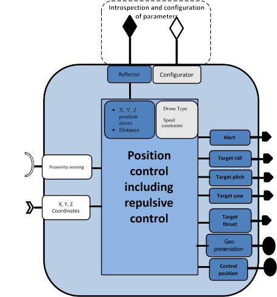
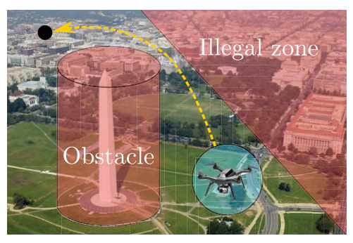
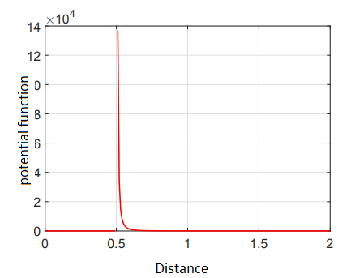

# WP3-14_1 – Control component for implementation of potential barriers
|||
|-|-|
|ID|WP3-14_1|
|Contributor|ENSMA|
|Levels|Function|
|Require|Proximity sensor |
|Provide|Geofencing, obstacle detection and avoidance, geofence preservation, safe trajectory
|Input|X, Y, Z coordinates of the drone Roll, pitch and yaw angles of the drone Distance to the obstacle from sensor proximity detection Geofence virtual boundary information|
|Output|Required X, Y, Z torques and thrust or rotors’ speed|
|C4D building block|Geo-fencing and geo-awareness|
|TRL|3|

  
Figure 53: Building Block diagram for WP3-14_1

## Detailed Description

The growing popularity of small civilian drones has generated a wide array of complex and unprecedented challenges related to the risks posed to security, safety, potential to disrupt people’s privacy and interfere with activities on the ground and with the manned aircrafts. This necessitates the development of technologies that allow UAVs to safely navigate according to the regulations.
Geofencing technique can be used to specify no-fly zones for drones. It is a technique that defines virtual boundaries in a specific geographical area. Once these virtual boundaries are defined, the drone should never be able to penetrate through these boundaries. In other words there should be a potential barrier that prevents drones from crossing the geofence boundary and redirect their trajectory to avoid any conflict. 
The drones must not only respect the geofence but should also be capable of detecting and avoiding any obstacle in their path. The obstacles could be stationary (e.g., buildings) or moving objects (e.g. birds, other drones or manned aircrafts). 
A drone could either be autonomous or remotely controlled by an operator. In both cases, the potential barriers must repel the drone automatically and generate a warning of alert whenever it is near the restricted area or any obstacle in path that could cause a collision. 

  
Figure 54: Geofencing example

## Specifications and contribution

The purpose of this component is to provide a mechanism which ensures that the collision between the drones and obstacles never happens and geofence is always preserved. 
From a technical viewpoint, preventing drones from violating the boundaries defined by the geofence system can be considered as a constrained control problem. Constrained control addresses the problem of enforcing constraints satisfaction at all times while ensuring that control objectives are achieved. It is required that the geofence information is provided to the drone and that information could be updated online while the drone is in operation.
In order to avoid collision with an obstacle, it is assumed that drone is equipped with proximity sensors and can detect any relative position of both non-cooperative and cooperative entities within a sensing range. A cooperative entity is another drone which has the same capability. In contrary, a non-cooperative entity is an entity without collision avoidance system. 
Sensing capability is required to sense the presence of any other entities in its close vicinity which may lead to a collision. These sensors only give the relative position of any entity in its range in the local frame and do not provide position information in the global frame. It is to note that this assumption is used for the purpose of collision avoidance only.

## Design and Implementation

A potential barrier for geofencing and collision avoidance can be achieved using Artificial Potential Function (APF). In APF, a drone is considered as a point in a potential field. This drone experiences a repulsion force from the obstacles or geofence and therefore, instead of colliding with them, it steers away from them.
Typically, potential functions are based on the relative distance between drone and the obstacle or the geofence and do not require any global information. Based on the practical aspects, an ideal potential function must have the following properties:

- The range of the potential field must be bounded. Usually, it depends on the range of obstacle sensors mounted on the agent.
- The value of the potential field and the corresponding repulsion must be infinity at the boundary of the obstacle/geofence and must decrease with the increase in the distance
- First and second derivatives of the potential function must exist in order to have a smooth repulsion force

APF based repulsion mechanism is combined with the control algorithm, for instance it could be combined with the position control of the drone. The repulsive force remains zero when the distance is greater than some predefined value and position controller works normally. However, when the distance becomes less than the threshold, the repulsive force comes into play and lesser the distance more will be the repulsive force. 
Figure 55 shows a graph of distance based potential function.

  
Figure 55: Potential function for collision avoidance and geo fencing

The detection range is considered as 2 meters and the protection radius around the drone is 0.5 meters. It can be observed that the value of the potential field increases as the distance between the fence/obstacle and the drone.  This will act as the repulsive force and push the drone away from the fence/obstacle.

