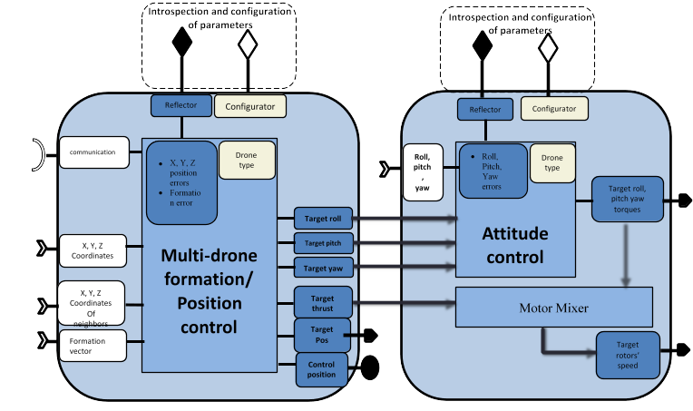
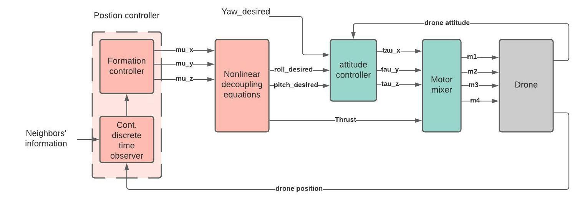
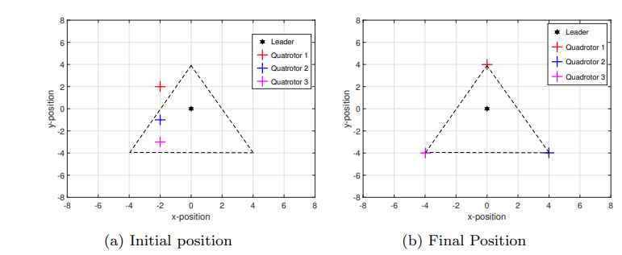
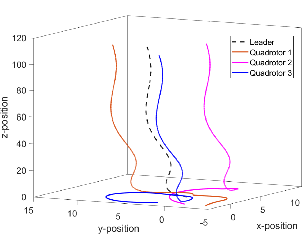

# WP3-14_2 - Multi-agent swarm control

|||
|-|-|
|ID|WP3-14_2|
|Contributor|ENSMA|
|Levels|Functional
|Require|Communication service to obtain data from the neighbours
|Provide|Control algorithm for swarm formation control and cooperation, Inter-agent collision avoidance, Obstacle detection and avoidance, as well as mathematical stability proof of formation tracking 
|Input|X, Y, Z coordinates of the drone Roll, pitch and yaw angles of the drone X, Y, Z coordinates of neighbours Formation vector Possibly proximity sensors
|Output|Required roll and pitch angles and thrust if used standalone, or rotors’ speed if used jointly with the attitude controller
|C4D building block|Flight guidance if standalone, both Flight guidance and Flight control if used jointly with the attitude controller
|TRL|4

  
Figure 56: Building Block diagram for WP3-14_2

## Detailed Description

The effectiveness of the drones can be further improved by utilizing them in a cooperative manner to accomplish much more complex tasks which cannot be realized by solo operation. Control of such cooperative teamwork of Multi-Agent Systems (MAS) heavily depends on communication and information exchange among the agents. This gives rise to two natural choices of communication network which are centralised and distributed control network. In centralized communication, as apparent from the name, there is a central unit to which all the agents are connected to and send their information. The central station handles all the information exchange and sends control commands to the agents. This kind of scheme has some major drawbacks. For example, if the central unit fails, the whole network will collapse. Moreover, a centralized control scheme cannot handle large number of agents due to network saturation and/or limited computing and processing capability etc. On the other hand, a distributed control scheme does not require a central control unit. Agents communicate directly with their neighbouring agents and exchange information. The information received from neighbours is also called local information. Each agent in the distributed network uses this local information to compute its own control input. Distributed control schemes offer many advantages over the centralized control scheme in terms of efficiency, adaptability, robustness, and scalability.
In many practical scenarios, it is required that the agents of MAS create and maintain a desired geometric shape. The required shape could either be fixed or time varying. In some cases, it is further required that the agents follow a trajectory while maintaining the shape. The reference trajectory is produced by a virtual or real leader. This is known as formation tracking.

## Contribution and Improvements

The main goal of this enabling technology is to offer a distributed formation tracking controller for a swarm of drones. From the state of art, it is clear that the available cooperative control schemes do not take various practical limitations in-to account. Motivated by this, we focused on the design and implementation of distributed cooperative control laws for a swarm of drones with communication and sensor constraints described below in details. 

- Generally, formation controller requires both position and velocity of the neighbours for its computation. However, it is not always possible to measure all the states in real applications. Moreover, sending partial information consumes less bandwidth and thus is very cost effective. Therefore, it is considered that only position information is shared between the agents. We consider that velocity and control input of neighbours are not available. 
- The data is transmitted between the agents at irregular and asynchronous time instants. Here, asynchronous means that the time of the transmission of the position data by one agent does not depend on any other agent in the network. In other words, an agent can receive information from its neighbours at different time instants. In fact, having irregular and asynchronous time periods in any practical case is totally inevitable.
- Another constraint that is taken into account is that the communication between the agents could either be directed or undirected. Directed communication means that if agent i can receive information from agent j then it does not imply that agent j can receive information from agent i. 
- Only a few agents in the network have the access to the reference trajectory produced by the virtual or real leader

Since inter-agent collision is another important issue in formation tracking control, a potential function based collision avoidance algorithm is incorporated with the proposed formation tracking controller. The collision avoidance algorithm ensures that the drones converge to produce the desired geometric shape without colliding with each other. The desired geometric shape can be defined by a formation vector.

## Design and Implementation

Since the drone is an under-actuated system (e.g. quadrotor has 6 states and 4 controllable rotor speeds), the design of controller is not straightforward.  To achieve the desired formation of a swarm of drones, the overall dynamics of the drone is divided into two blocks namely position dynamics and attitude dynamics with a strong nonlinear coupling among them. The idea is to introduce an auxiliary position controller and design it while keeping all the above mentioned constraints in mind. The required thrust and attitude then can be computed through this auxiliary position controller. An attitude controller then can be designed to achieve the required attitude by the drone and which makes the drone to reach to the required position to achieve the desired formation shape. Figure 57 shows the block diagram of the overall control architecture of one drone to achieve formation tracking of the swarm of drones. The position controller computes auxiliary position controller  which is then used to compute desired roll and pitch through nonlinear decoupling equations. These desired roll and pitch angles act as a reference input to the attitude controller which computes the required torques to track these desired angles.

  
Figure 57: Overall control scheme for formation tracking

__Formation controller:__ The basic idea is to use a classical continuous linear consensus controller for MAS of second order dynamics. By introducing the auxiliary controller, the position dynamics can be represented as double integrator. However, trivial formation controller requires both position and velocity in continuous time. A continuous-discrete-time high-gain observer is used to compute both position and velocity from available discrete position data. Each follower has a local observer which not only estimates the agent’s own states but also the states of its neighbours. The structure of the proposed observer-based formation tracking algorithm also has some advantages when it comes to communication delays and data packet dropouts. As each controller is using the estimated states provided by the local observer, by time stamping the measured position data, the estimation can be provided as soon as the data is received, even with a delay, by compensating it through increasing the computation speed of the observer. Moreover, if the information packet is lost during communication, the observer could still provide an estimation. 

An Artificial Potential Function (APF) based repulsive controller is also incorporated with the formation controller to avoid any kind of collision among the agents and with obstacles. APF provides a repulsive force whenever the distance between two bodies becomes less than some threshold. It is considered that each drone is equipped with some kind of proximity sensor to detect anything in its path. 

__Attitude controller:__ For the Matlab simulations, the desired attitude is computed through the auxiliary controller and then a finite-time attitude controller is used to compute the required torques to achieve this desired attitude.

__Simulations:__ The designed control scheme is simulated for a group of one leader and three follower quadrotors where followers are required to make a triangle around the leader in xy-plane and maintain the same altitude as of the leader. Figure 58 illustrates the formation with a stationary leader while Figure 59 shows formation tracking results with a moving leader. The threshold distance for the repulsive force is considered as 2 meters while the protection radius around each drone is 0.5 meter. Figure 60 shows that the inter-agent distance always remains greater than 1 meter which implies that the agents never collide during the whole process.

  
Figure 58: Formation tracking with stationary leader, distances in meters

  
Figure 59: Formation tracking with a moving leader, distances in meters

  
Figure 60: Inter-drone distance, in meters

The simulation results show the stability of the system with the designed algorithm for formation tracking. However, simulation results are not sufficient to prove the stability of the system. Therefore, a rigorous mathematical proof has been also carried out to ensure the formation tracking and stability of the closed loop system with the designed controller.

