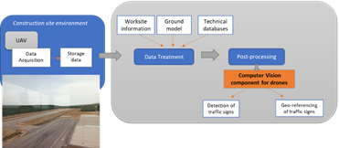
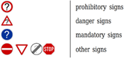
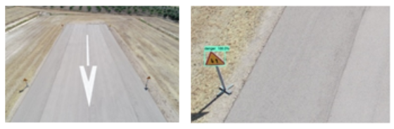
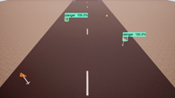
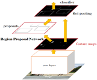
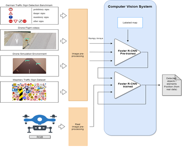
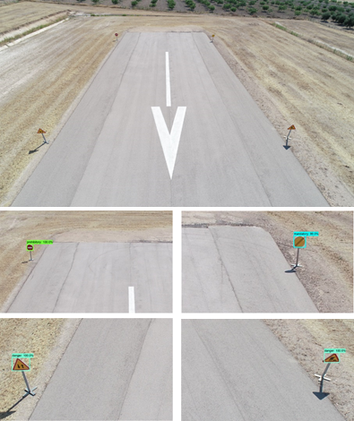

# WP3-04 - Computer Vision Components for drones

|||
|-|-|
|ID|WP3-04|
|Contributor|HIB|
|Levels|Functional|
|Require|Payload data (drone images)|
|Provide|DL-based SW to detect and classify objects (road elements, traffic signs) from images captured by drones|
|Input|RGB images captured by drone (Payload data)|
|Output|Inventory of road elements with their position in the terrain|
|C4D building block|(Video) Data Analytics|
|TRL|5|

## Detailed Description

Machine learning and deep learning are an arising approach in dealing with large amount of data gained from drones [19]. For infrastructure planning and design, typical data acquired through drones are images. For construction monitoring, either real time videos or 3D models are needed. Focusing on object recognition and detection in aerial images captured by drones, a major challenge with the integration of artificial intelligence and machine learning with autonomous drones’ operations is that these tasks are not executable in real-time or near-real-time due to the complexities of these tasks and their computational costs. In the last few years, deep convolutional neural networks have shown to be a reliable approach for image object detection and classification due to their relatively high accuracy and speed. Furthermore, a CNN algorithm enables drones to convert object information from the immediate environment into abstract information that can be interpreted by machines without human interference. Thereby, the main advantage of CNN algorithms is that they can detect and classify objects while being computationally less expensive and superior in performance when compared with other machine-learning methods. 
In the C4D project scope, the computer vision component for drones brings a deep learning-based software which uses a convolutional neural network (CNN) algorithm to detect, and classify objects from raw data in such a way that it brings to the project capabilities of interpreting surroundings and detecting scenarios from data captured with drones.

## Contribution and Improvements

Concretely, the proposed application scenario for the computer vision component for drones is the inspection, assessment and maintenance of civil infrastructures and construction elements, in which many inventories for damage and defects detection are carried out. Such inspections and the corresponding inventories are performed through human visual observations, being a tedious and time-consuming work prone to human errors, and therefore, an expensive work, so accelerating such inspections is a current challenge in the construction industry.
Then, the Computer vision component for drones is a post-processing computer vision system based on previously trained CNN algorithms which enables the auto-detection and geo-referencing of different objects from RGB images captured by the drones’ on-board camera. Particularly, this computer vision system intends to improve the digitalization of the state of the constructive process of a Civil Infrastructure by auto-detecting and geo-referencing different road elements which can be found in any civil infrastructure or construction elements. Thereby, one of the main challenges in the construction industry like the road element inventory realization is solved.

  
Figure 36: Computer Vision Component in the application scenario 

Considering the C4D Reference Architecture Context, the computer vision component for drones supports the (Video) Data Analytics building block in the Data Management block by performing an offline data analysis over the RGB images (that is, payload data) captured by the UAV in order to provide an auto-detection and geo-referencing of different objects. Although this computer vision component for drones will provide to the Business domain an inventory of the road elements detected and their corresponding position in the terrain to serve as input for the creation of the BIM model, this computer vision component for drones could be extended for other business functions following the generic Building Block defined for the Payload Data Analytics.

## Design and Implementation

The computer vision component for drones is being developed following the typical steps for a deep-learning-based SW:

1. Dataset creation 
2. Election of the most accurate object detection model.
3. Training of the object detection model using previously created dataset.
4. Testing of the object detection model already trained.
    
So, it is possible to state that the computer vision component for drones is built upon two main axes: the dataset and the object detection model.
For the dataset creation, several available datasets have been contemplated:

- __German Traffic Sign Detection Benchmark (GTSDB)__ [20], which is a single-image detection dataset based on images taken in Germany. It contains around 900 images, 600 for training and 300 for test. The traffic sign classes in this dataset are shown below:

      
    Figure 37: Traffic sign classes in GTSDB

- Images from __drone flight videos.__ This dataset is built with the images captured during the 1st data acquisition campaign performed in UC2 – Construction in Jaén (Spain). An example is shown below:

      
    Figure 38: Example of images from drone flight videos

- Dataset built from the videos generated with __AirSim (drone simulation environment)__.

      
    Figure 39: Example of images from drone simulated flight videos

- __Mapillary Traffic Sign Dataset (MTSD)__ [21], which it is a dataset with street-level images around the world. These images are annotated with bounding boxes and traffic sign classes. There are 100000 high-resolution images, 52000 of them fully annotated. Also, there are over 300 traffic sign classes, as it is shown below.

      
    Figure 40: Overview of all traffic sign classes in MTSD

Related to the object detection model, Faster R-CNN [22] is the model used to date, and it is an object detection system proposed by Ren et al. in 2015. Its architecture is shown in Figure 41 and it is formed by two components: Region Proposal Network and Fast Region-Convolutional Neural Network.

  
Figure 41: Faster R-CNN model general architecture

Concretely, Region Proposal Network (RPN) is a deep convolutional network that proposes image regions where an object might be found. RPN component acts as an attention mechanism that accelerates region proposal phase, and in our use case, it creates new regions (bounding boxes) where a traffic signal exists. Complementarily, the Fast Region-Convolutional Neural Network (Fast R-CNN) [23] takes the regions proposed by RPN and classifies them efficiently. In our use case, this component classifies traffic signal regions in ‘Mandatory’, ‘Danger’, ‘Forbidden’.
Below, it is shown an implementation conceptual diagram for the computer vision component for drones. 

  
Figure 42: Implementation conceptual diagram for computer vision component

Based on Figure 42, the data flow of computer vision component for drones is detailed as follows: 
1. Setup of all prerequisites: software libraries are installed and loaded, and dataset and pretrained model are downloaded.
2. The pretrained Faster R-CNN model is loaded into memory using TensorFlow Object Detection API [24] 
3. The label map is loaded into memory. This object maps the three category indices to category names for the translation of the model’s predictions.
4. The pretrained model performs detection over test set images.
    1. Each image is prepared with Pillow library.
    2. Images are transformed into Numpy arrays.
    3. Images are preprocessed for the model to make predictions on them.
    4. Detection takes place.
5. Predictions are visualized with TensorFlow Object Detection API and Matplotlib’s Pyplot module.
Below, it is possible to see traffic sign detections on images from real Drone Flight Videos by the Faster R-CNN model implemented in the computer vision component for drones.

  
Figure 43: Detections performed by Faster R-CNN on a Drone Flight image. (top) The model fails to perform any detection over the whole image. (bottom) After chopping the image, the model correctly detects and identifies the four traffic signs.

