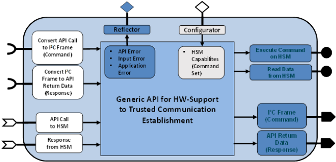
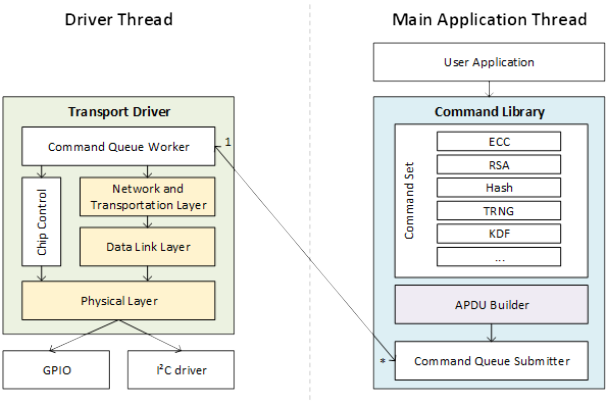

# WP3-10 - Generic API and component for trusted communication
|||
|-|-|
|ID|WP3-10|
|Contributor|IFAT|
|Levels|Function|
|Require|HSM-chip| 
|Provide|C-based API-lib for accessing HSM hardware-functionality|
|Input|API-call + generic byte-array (e.g. data to be signed)|
|Output|Low-level I2C commands, return data to API|
|C4D building block|Communication|
|TRL|5|

  
Figure 44: Building block diagram for WP3-10

## Scope and contribution

One – small yet important – piece of a jigsaw of an overall drone architecture is protecting the data to be transmitted via various wireless communication channels, and as a consequence thereof the required remote authentication. Protecting the communication link of a drone to any other end point (e.g. other drone, base station, and infrastructure) is important. Otherwise, the communication partner cannot verify if the communication link is established to the partner intended to. Further, in is required to maintain integrity as well as confidentiality. Therefore, in many embedded systems, a protected communication link is established via TLS between the communication partners. However, in today’s embedded systems, all security-critical TLS mechanisms are typically purely executed in software in the microcontroller alongside the embedded OS and various applications. This conventional system design also makes the pure software-based TLS prone to software and side-channel attacks. Therefore, to minimize the attack vector, IFAT is developing an enhanced security concept, in which the TLS handshake is supported with a Hardware Security Module (HSM, alternatively also denoted as Secure Element (SE)) in order to perform certain security critical operations and store confidential key material. 
While in the course of WP5 IFAT is working on the higher-level implementation of the required security-specific algorithms and libraries, in the course of WP3 IFAT is working different aspects of defining a standardized lower-level API for the easy and modular integration of such a hardware security component into any modular drone architecture. The main purpose of this (low-level) API is to make the required functionalities of an integrated HSM accessible to various drone software-frameworks, which typically are executed on a general purpose microcontroller in C programming language (such as ROS for example). Furthermore, the API is designed in a generic way, in the sense that the same API shall be usable for more than just one hardware security device (since today most new generation/releases of HSM devices have slightly different command sets). In this way, within WP3 IFAT provides a concept to integrate hardware security components into drones with an API to be usable for future drone system integrators for various security relevant tasks. This concept will be described in more details in the paragraphs below.

## Design and Implementation

To access the functionality of an HSM, a command library needs to be designed and implemented. An important requirement in this regard is modularity. This is important to prevent code duplication in future developments and easy replacement of HSMs. Based on that design decision, various different use cases can be addressed due to the high reusability. Therefore, the API for the command library used to establish a trusted communication channel shall be design in a generic way. Additional requirements would be a small memory footprint and multi-threading support. First, many embedded systems have limited resources, and second, the driver should not use any blocking functions, because this would be disastrous in multi-threaded environments. The latter requires synchronization between the API function.

### Architecture Design

As depicted in Figure 45 the multi-threaded architecture is split into two main parts, the transport driver and the command library. The transport driver is communicating with the HSM, whereas the command library exposes the functionality to the higher level user application.
Splitting the architecture in transport driver and command library allows being independent of the hardware, since the provided features of the hardware are different, and the command set can easily be extended. Executing a specific API function results in a serialized command which is added into the command queue by the command library. The transport driver processes the command and relays it via the I2C driver to the HSM, where it is executed and passed back via the transport driver to the command library and subsequently to the user application.

### Transport Driver:

The implemented driver (SW-Library) reflects similar layers, which are depicted in yellow in Figure 45. The physical layer mainly consists of a set of registers to communicate with the two surrounding modules, the I²C driver and the data link layer. The data link layer is providing reliability to the communication channel by adding checksums and sequence numbers. Network and transport layer are combined in one module for simplification, since they share the same header structure. The main task of the transport layer is the packet fragmentation. The command queue worker is the direct interface to the command library and handles the state machine to communicate with the HSM. The chip control is out of scope for this deliverable, but it handles the power management of the HSM.

### Implemented generic HSM command library:

When the user application calls an API function, the command library serializes with the APDU-builder, into the standardized “APDU”1 format and submits it to the command queue. The command format is different for various devices, but devices from one product family mostly share the same format. This shows again the importance of splitting the architecture into the lower level transport driver and the command library to offer a generic solution. As depicted in Figure 45, the command library offers a basic set of functions which is used by the user application to establish a trusted communication channel.
This generic library-abstraction a) helps to ease the integration effort for drone system integrators to integrate a HSM component into their drones, and b) provides a more generic API (as compared to state-of-the-art) in the way that the API is not limited to just one specific version of HSM chip-variant. In the case of IFAT, this API is planned to support different Infineon hardware-security chip family derivates and also upcoming versions.

  
Figure 45: Generic architecture design and implemented SW-API for integrating Infineon HSM modules into a drone

