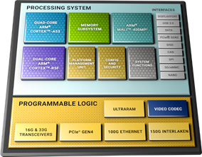
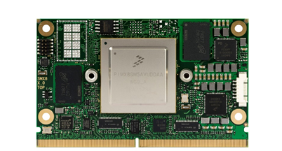

# WP3-01 - Drone Pre-certified MPSoC based module
|||
|--|--|
|ID|WP3-01|
|Contributor|IKERLAN|
|Levels|Functional|
|Require|Communication service to obtain data from the neighbours|
|Provide|Hardware blueprint for implementing different architectural blocks, such as, obstacle detection or obstacle avoidance. |
|Input|Sensor data or obstacle distance data|
|Output|Required obstacle distance or the new trajectory for avoiding the present obstacle.|
|C4D building block|Obstacle Avoidance, Obstacle Detection.|
|TRL|4|

Nowadays, commercial drones rely heavily in the use of microcontrollers to execute the autopilot that controls it. This is the case of the most used autopilots, such as, PX4, Paparazzi or Ardupilot, which has been analysed in the scope of this project.
In recent years, these drones had added several features that makes them more autonomous, not needing an external input to offer more secure and reliable flights; and are capable of doing more and more tasks, such as in-flight object detection, sensor data gathering and processing, or SLAM algorithm execution. 
This has been enabled by additional computing capabilities delivered by companion computers packed in within drones.
Year by year, this extra computing power is increasing in capability, power performance or factory form, allowing to implement more complex behaviours in drones, that were not possible not that long ago.
Following this trend, the use of FPGA in edge devices hasn’t been that common in contrast to GPUs or ARM-based processors. One of the reasons behind is because of its programming complexity, they require a deep knowledge of how they work and expertise to program them. But state-of-the-art AI techniques and data processing algorithms are nowadays commonly implemented in such systems, extending the usage of this devices.
In the project scope, the Drone pre-certified MPSoC based-module brings a modular hardware blueprint to enable and ease the use of modern heterogeneous-computing architectures to the drone architecture.
The device contains a Zynq-UltraScale+ SoC that provides of a flexible computing architecture, which contains a quad-core ARM processor capable of running Linux, dual-core Cortex-R5F optimized for real-time and safety-critical applications and a FPGA for parallel algorithm execution and data processing- to implement demanding computing and communication applications. This SoC provides the means of creating tailored computational architecture for the target applications, considering safety or real-time aspects.
In addition, the device has been designed following modular approach, mimicking the reference architecture, to enable the reuse of the hardware in different use-cases and building blocks.

  
Figure 29: Xilinx Zynq UltraScale+ architecture block diagram

## Design and Implementation

To bring hardware modularity for such a complex piece of hardware, the system has been designed following the SMARC (Smart Mobility Architecture) standard. This standard was created by SGeT (Standardization Group for embedded Technologies), a non-profit organisation.
This standard defines a set of requirements for Computer Modules, which are leveraged in size, mechanical and electrical characteristics, connection pin out and properties or capabilities. Thanks to this, self-contained and defined embedded Computer Modules has been created that are part of a new standardized ecosystem, allowing the use of several vendor Computer Modules in the same manner.

  
Figure 30: Congatec NXP i.MX8 SMARC 2 module

As the Computer Modules provides encapsules all the computing capabilities, but lack of interfaces to interact with other devices, the use of Carrier Boards is necessary. These Carrier Boards provides of the feeding voltages, communication PHYs or/and connector to interoperate with other devices.
The Drone Pre-certified MPSoC based module is being designed following the SMARC standard, fitting a Zynq UltraScale+ SoC and adding additional electronic devices, such as RAM and eMMC memory chips, to be capable of running complex software and Oss, such as Linux.
The Carrier Board is being designed having the drone hardware requirements in mind. The design provide means of connecting sensors to the hardware. For that purpose, Ethernet, USB, or CSI ports has been added. These communication means are commonly used to connect sensors like Lidars or cameras that enables the execution of object detection and classification, obstacle avoidance or other tasks, such as data gathering. In addition, it provides of I2C and SPI bus connection, which are widely used to attach low throughput sensors or microSD slot for data recording. It also provides 12v feeding port, to feed attached sensors.
In addition, a safety assessment has been done to ease the compliance of regulatory requirements. As outcome to this assessment, additional hardware elements have been added to mitigate the identified risk sources.

  
Figure 31: A preview of the Ikerlan’s Mammut Carrier Board

All this hardware provides the basis for implementing desired building blocks, thanks to the powerful computing capabilities and flexible hardware setup.
The next section provides insight of how this developed design eases the integration of architectural building blocks.

## Contributions

To understand better the impact of the developing hardware, Figure 32 abstracts how a C4D building block would be implemented in the Drone Pre-certified MPSoC based module, in this case, an Obstacle Detection block.

As we can see, the developed hardware can contain all the hardware and software elements that would supports the building block. Thanks to its physical interfaces, an obstacle sensing device can be plugged, for example, a LiDAR. The Mammut Computer Module would be able to fetch the data thanks to the drivers and execute the specific algorithms. These algorithms could benefit of the programmable logic unit, which offers parallel computing and high frequency throughput. Once that is ready, it would send that data, in the specified data bus by the C4D architecture to the rest of C4D building blocks. 
This setup can be replaced, adapting the required functionality, and deploying new C4D building block.

  
Figure 32: Building block implementation conceptual diagram

