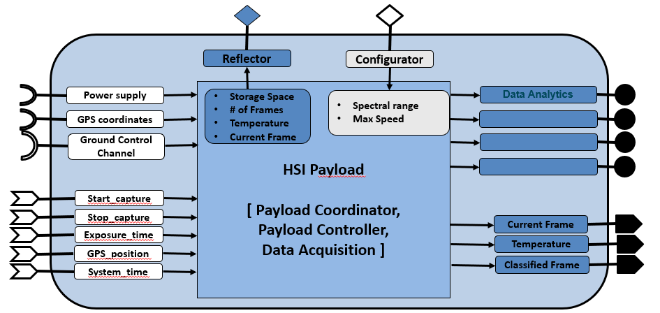

# WP3-19_1 - Hyperspectral payload

|||
|-|-|
|ID|WP3-19_1|
|Contributor|IMEC|
|Levels|Functional|
|Require|Power, GPS coordinates, data & control channel to ground controller|
|Provide|Data analytics & spectral data|
|Input|Start/end capture signal, exposure time, GPS coordinates, system time|
|Output|Current captured hyperspectral frame, classified images, data analytics, spectral hyperspectral data|
|C4D building block|Hyperspectral payload|
|TRL|6|

  
Figure 71: Building Block diagram

## Detailed Description

Essentially, the Hyperspectral payload captures hyperspectral images, tags the images together with GPS coordinates, stores the images locally, processes the data to provide certain analytics, and sends the raw and classified/processed images to ground controller.

The hyperspectral payload can be coupled together with a certain drone system. An example of the integration is shown in the figures below. The integration is on three aspects: physical connection, control interface and the data connection between drone and payload. The physical connection is usually done via a gimbal. The control connection is done via a serial port over which commands can be sent to the payload to set the relevant parameters for the sensors in the payload. The data connection is done via Ethernet/HDMI connection, where the drone controller can request specific frames/info from the sensors that can eventually be sent to a ground controller. This information can also be used to synchronize between payload data and other sensors (e.g., GPS) or other payloads connected to the drone. The images from this sensor are unique in that they can provide hyper/multi-spectral images of up to 40 spectral bands in the range 450-900 nm.

## Contribution and Improvements

Currently, there are no real lightweight hyperspectral UAV cameras which have more than 4/5 bands. Such a camera would be a real breakthrough in the domain of UAV precision agriculture. Parrot’s sequoia multispectral camera with about 4-5 spectral bands is the leading state of the art in this domain. However, with 4-5 spectral bands only simple agriculture indices like NDVI can be extracted. Tetra cam’s 3-filter camera or multi-camera systems supporting up to 12 bands are other alternatives. However, multi camera systems lead to much more bulkier systems with additional complexity of software to register images from different cameras to obtain the same spatial field of view, which could potentially lead to loss in image quality. For our target applications more spectral information would be required (>10 bands in VISNIR) to provide accurate diagnostic and actionable information. Our proposed camera can enable such applications. Headwall’s micro-hyperspec  is another camera intended for UAV platforms, which uses conventional grating-- based solutions for the spectral unit. This leads to a bulkier camera than our proposed solution, making this unsuitable for lightweight drones. Micro-hyperspecs cameras can weigh up to 1kg or more, making this perhaps more suitable for larger drones/UAVs.

Compared to other multispectral payload systems, this system has a significant improvement in the number of spectral bands, typically from 5-10spectral bands to up to 40 spectral bands. This enables higher precision and accuracies in current inspections and also enables new inspection methods (e.g., inspection of soil quality, which conventionally would have required sending the samples to a lab).

## Design and Implementation

The core design of the payload and its integration with the drone system is shown in Figure 72.

  
Figure 72: System architecture of UAV payload with compute enabled system

A first prototype payload has been built by Airobot to be able successfully perform first data collection flights. The pictures below show the integration on the Airobot Mapper drone and of the first test flight.

  
Figure 73: Prototype payload on Airobot Mapper

As a second prototype, IMEC-BG has implemented a second iteration of the payload. The payload consists of two multispectral sensors in the spectral range 470-900nm, a jetson Tx2 to enable onboard computation and about 1TB of storage to collect spectral data during flight. In addition to the payload integration with a drone as described by Airobot, IMEC has done initial integration (both hardware and software) of this payload with a DJI M600 drone. This integration was done to show the modular and flexible aspect of our payload and data acquisition software blocks. Current software development for this version of the prototype has two parts (1) firmware/acquisition software running on the payload/jetson system and (2) ground controller software running on a tablet which is connected to a drone controller. The key functionality of firmware block is to capture the data from the two multispectral sensors and perform initial pre-processing steps and store them on onboard disk. The key functionality of the ground controller software is to enable user to control camera parameters and to provide a live preview of the images from spectral sensors.

  
Figure 74: Prototype IMEC payload

Finally, Airobot has been working together with IMEC on working out the detailed design to integrate their payload. The mechanical, electrical and software interface has been defined.  To speed up the development a setup has been created so that the software development can be done without needing physical access to the drone. 

  
Figure 75:  Architecture of interface with IMEC payload

