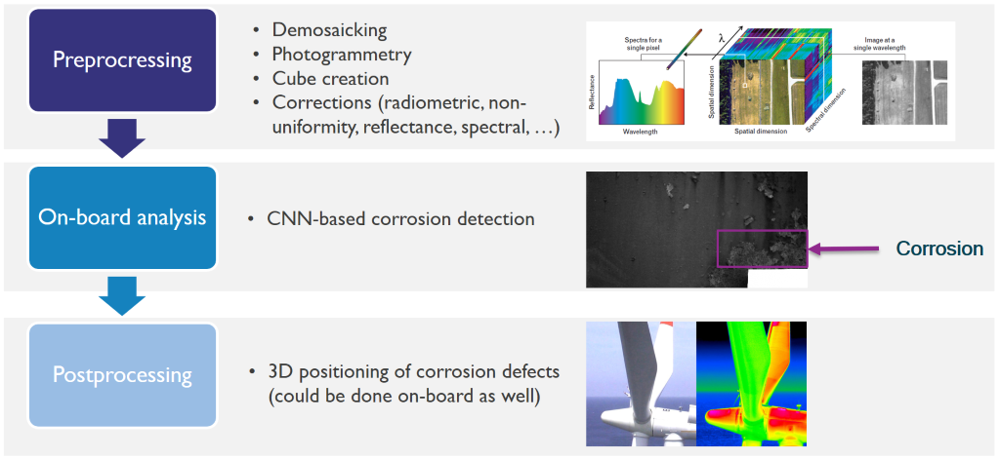
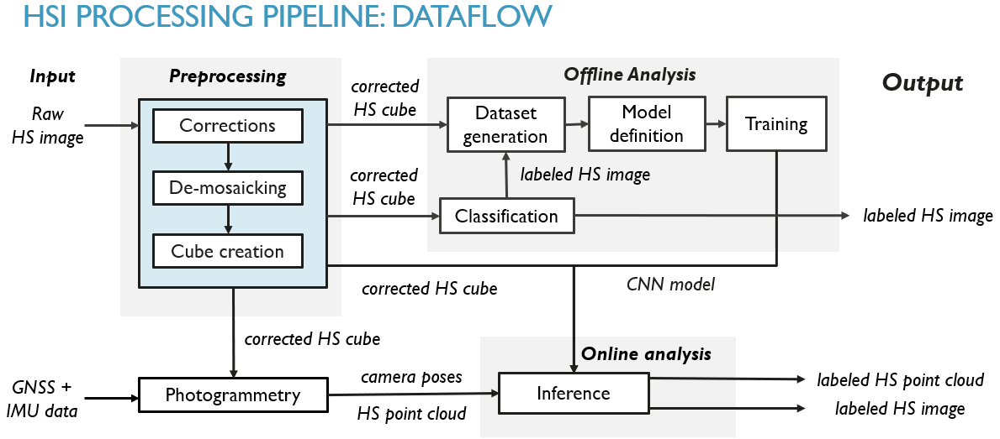
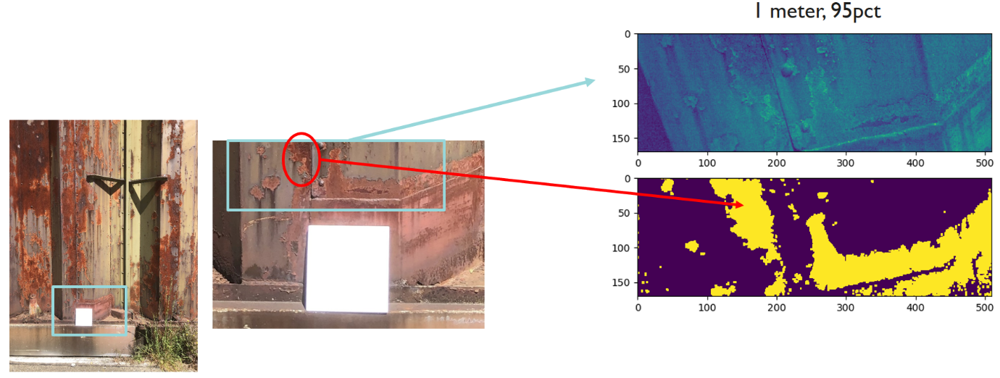
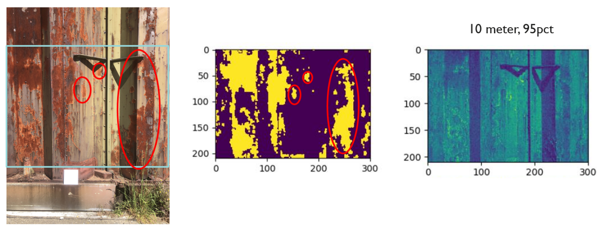

# Hyperspectral image processing

|||
|-|-|
|ID|WP3-19_2|
|Contributor|IMEC|

## Detailed Description
The hyperspectral imaging (HSI) pipeline is a system that processes and analyses the hyperspectral data originating from the hyperspectral payload developed by IMEC. It supports a drone system in many aspects. First, it provides an API to easily access radiometric- and reflectance-corrected hyperspectral images. Second, it implements tools to compress the data in a lossless manner to limit storage needs. Third, it provides a fully automated way of stitching the images together into a georeferenced orthomosaic. Finally, the HSI pipeline also accommodates an API to easily interpret the data by semantically labelling the data (i.e., assigning a class label to each pixel of the image) also known as classification. The latter is done in a semi-supervised way and supports many different use cases, including applications on surveillance and inspection.

In the context of the reference architecture, the hyperspectral imaging (HSI) pipeline supports payload data analytics block.

The second innovation involves data-analytics on images to detect imperfections, like corrosion, deterioration of paint, real-time or offline. The hyperspectral imaging (HIS) processing pipeline that we are developing is depicted below. It is made up of three main modules: pre-processing, on-board analysis, and post-processing. 

  
Figure 76: The hyperspectral imaging processing pipeline

The hyperspectral images are finally stitched together, and a 3D model is constructed. To that end, our photogrammetry (or structure from motion) software was further enhanced in a way that it is better suited to cope with repetitive patterns in the environment. Photogrammetry in such challenging conditions generally fails using existing, commercial, software packages. Experiments with our improvements show that our pipeline is a lot better suited to cope with repetitive patterns in the scene.

The on-board analysis is dealing with the detection of degradations, i.e., corrosion, of the infrastructure. To this end we are developing AI-algorithms (CNN-based) that exploit both spectral and spatial futures to identify the regions where corrosion appears. 

## Contribution and Improvements
Currently, there exists many hyperspectral image processing algorithms (e.g., de-mosaicking for mosaicked sensor layouts or deep learning based detection, segmentation or classification). However, they are developed and designed for (off-board) PC platforms and are totally not optimized for the IMEC’s hyperspectral dual camera payload, integrated nor run on embedded hardware platforms such as the Jetson TX2 board.

Classic deep learning frameworks rely on massive amount of annotated data, over which we will not dispose (and are not able to collect ourselves). Therefore, we rely on recently developed few-shot learning techniques, which are trained with only a limited number of annotated samples. However, the robustness under various noise conditions and few-shot learning performance needs further research. In the case of hyperspectral imaging, this will also impact the acquisition: e.g., the varying incident sun light will create different appearances of the same physical material. Proper normalization procedures are needed to be developed.

The entire pipeline is made up of three main modules: pre-processing, on-board analysis, and post-processing, as can be seen in the figure above.

The on-board analysis is dealing with the detection of degradations, i.e., corrosion, of the infrastructure. To this end, AI-algorithms (CNN-based) are developed. A result of the current corrosion detection algorithm is depicted in Figure 40. The purpose is to implement these algorithms on the Jetson TX2 board for them to be executed in real-time. This way the corrosion parts can be identified and located online, and the drone can be instructed to fly towards the most degraded areas in order to limit fly-time and avoid those relevant areas remain uncaptured. The final goal is to achieve automatic HS-image-based detection and quantification of corrosion using AI technology with an accuracy of 80% compared to human inspections.

## Design and Implementation

A schematic overview of the dataflow for the HSI processing pipeline is depicted on the figure below. A raw HS image acquired by the payload is sent to the preprocessing module where several corrections are carried out, de-mosaicking is taking place and a HS cube is created. The corrected HS-cubes are then fed to the offline analysis module, where traditional classification algorithms can generate a labelled HS image. Alternatively, the labelled HS image can be fed to the dataset generation and model definition submodule in order to set up a CNN training environment. After the training, the CNN model is used in the online analysis module where inference can be applied on another HS cube. In parallel, position and orientation information (provided by the GNSS and IMU) together with the corrected HS cube is fed to the photogrammetry module to generate both, the HS point cloud and the camera poses. Eventually, both are fed to the inference submodule to create labelled HS images and a fully georeferenced, labelled HS point cloud.

  
Figure 77: The hyperspectral imaging processing pipeline

The HSI processing pipeline can be used to develop a state-of-the-art detector for corrosion on infrastructure or pollution in soil. A few collected HS cubes can be classified using traditional techniques to serve as a training dataset (after minor manual verification). A CNN model can then be trained and used to classify additional images using the inference module. Together with the output from the photogrammetry a georeferenced and labelled HS point cloud can be obtained.

The deep learning framework was evaluated using data captured near a gate that was subject to corrosion. Experiments demonstrated that we achieved an accuracy of 95% to 98% (depending on the CNN model) for classifying corroded areas (i.e., pixels) within the HS images. Moreover, we successfully tested the deployment of the network on a Nvidia Jetson Xavier NX. The inference to generate a labelled HS Image of 254x510 pixels can be conducted in a handful seconds on the Xavier NX. This allows for online processing and hence real-time applications, e.g., to instruct the drone to fly towards the areas of interest (indicated by the labelled image).

Using some of the prototypes from IMEC & AIROBOT, initial work on corrosion detection shows promising results as indicated below. The focus for the next period will be to reorient the instantiation of these algorithms towards soil quality instead of corrosion. 

  
Figure 78: Result of the corrosion detection algorithm at 1 meter distance: purple denotes back ground, yellow denotes corrosion

  
Figure 79: Result of the corrosion detection algorithm at 10 meter distance: purple denotes back ground, yellow denotes corrosion

