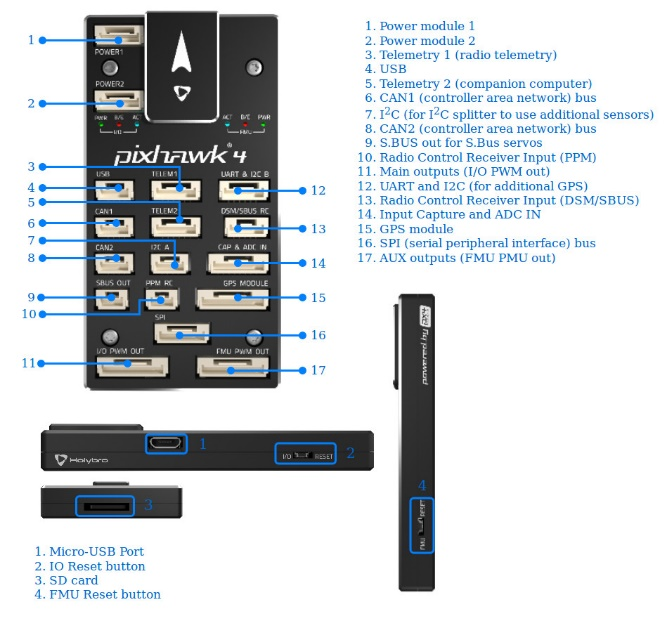
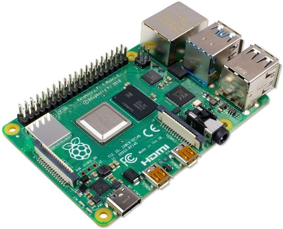
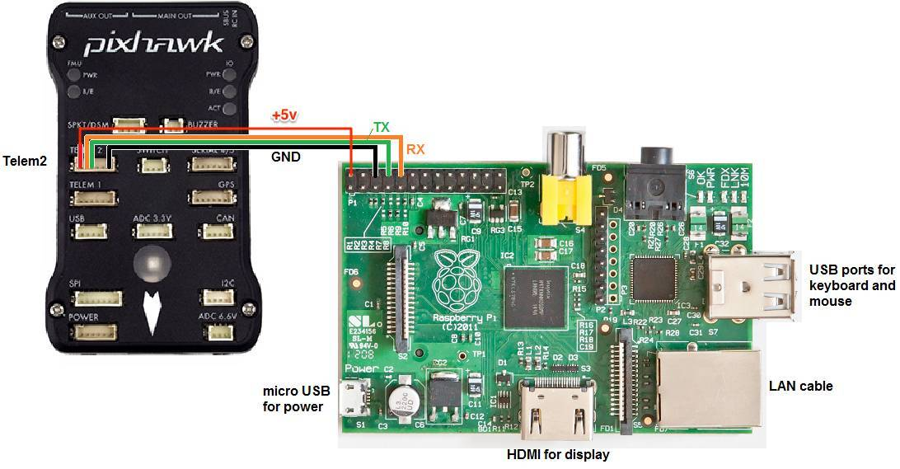
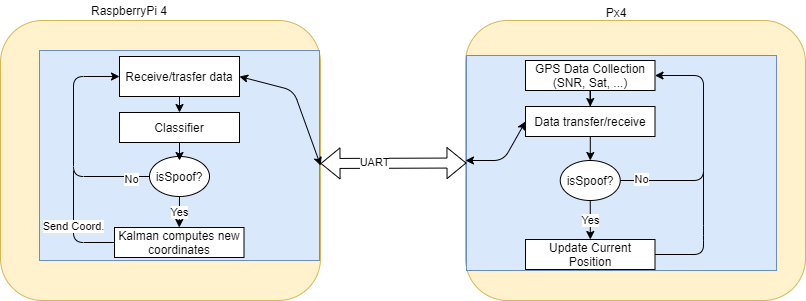

# WP3-20 - Multi-sensor positioning

|||
|-|-|
|ID|WP3-20|
|Contributor|MODIS|
|Levels|Functional|
|Require||
|Provide|GPS spoofing message detection using ML technique , position computation in absence of GPS based on sensors data|
|Input|Sensors data (gyro, accelerometer, magnetometer, GPS)|
|Output|Binary data to indicate absence or not of spoofing; X,Y,Z coordinates estimation if spoofing is detected|
|C4D building block|Continuous flight in without GPS information, spoofing detection|
|TRL|4|

## Detailed Description

Px4 autopilot is a system involving open source hardware and software freely available to everyone under BSD license. A Pixhawk board is developed according to the Pixhawk standard and conforms to the Pixhawk standard requirements. The Holybro board based on CPU STM32F765 is one of these supported HW and has chosen as the main board for drone controller. 

Holybro board is therefore responsible for piloting the drone, being equipped with an IMU sensor to control its angle, acceleration and orientation. The path that the drone must follow is established in advance and is followed by the drone thanks to the GPS receiver.

Detection of GPS spoofed messages is done with ML techniques, so a dedicated board is used to perform in parallel this task. There is also the need to collect debugging data and monitor the state of the execution so a Raspberripy 4B board is used to accomplish this.

  
Figure 80: A Pixhawk board

  
Figure 81: A Raspberry Pi board

Raspberry Pi has the ability to interact with the outside world and has been used in a wide array of digital maker projects, from music machines and parent detectors to weather stations and tweeting birdhouses with infra-red cameras.
The computational power is given by a quad core CPU (ARM) and its main memory (8 GB), which allows to manage the amount of necessary data to execute ML algorithms giving an answer in an acceptable time.
Raspberry Pi OS (Raspbian) is the recommended operating system for normal use on Raspberry Pi, it is Linux based and permits all useful canonical operation such as remote connection (ssh) and log management.

## Contribution and Improvements

Currently commercial drones do not have the ability to avoid certain attacks on the GPS for several reasons: there are different strategies to avoid a spoofing attack, many of these include expensive hardware devices both from the point of view of energy and space resources therefore not suitable for mounting on a UAV. 
The proposed solution combines the already strongly supported family of opensource drones with the potential of mini computers such as the raspberry Pi, and an attack detention strategy based on a supervised machine learning technique. 
This has several advantages: 

- decoupling between flight management and GPS flow analysis, 
- different power lines for the boards,
- continuous improvement of the classifier performance without affecting anything else of the system…

## Design and Implementation

In order to cooperate between the two devices, Holybro and Raspberry are connected via a UART serial interface.

  
Figure 82: Holybro and Raspberry communication

Both devices are tuned to the same transmission frequency and a data exchange algorithm is established to synchronize the devices on read/write. 
The Px4 basically has the task of recovering data, while the Raspberry is equipped with:

- a SVM (Support Vector machine) classifier previously trained on a private dataset of about 6000 data;
- a custom implementation of the extended Kalman filter for estimating the next geographic point without using GPS coordinates. 

Basically, the Px4’s task is to collect a quantity of data coming from the sensors over a period of time and sending them to the Raspberry Pi. On the other hand, the Raspberry reads the received data, classifies it using an SVM classifier, in case of spoofing it calculates the correct coordinates using a Kalman filter. Finally, it sends back the answer to Px4 which decides whenever to overwrite or not its GPS position based on the response. 

  
Figure 83: Global behaviour of the anti-spoofing function

