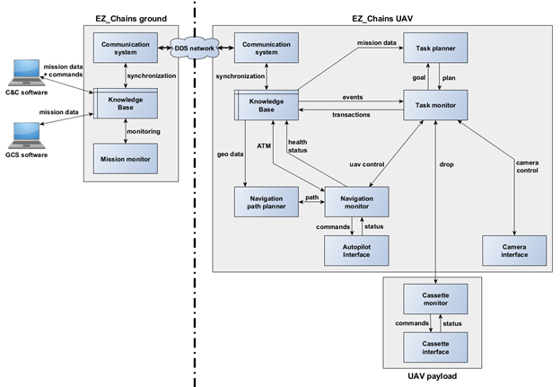

# WP3-16 - EZ_Chains Fleet Architecture

|||
|-|-|
|ID|WP3-16|
|Contributor|SCALIAN|
|Levels|Functional|
|Require|Interface with autopilot, communication link with other drones in fleet|
|Provide|Mission planning and monitoring for fleet missions, Flight planning and guidance taking into account the other UAVs|
|Input|Mission status, periodic updates of other UAVs, UAV position and attitude from autopilot|
|Output|Mission updates, periodic updates on current UAV, commands to the autopilot|
|C4D building block|Mission Management, Flight Guidance, Flight Planning|
|TRL|7|

## Detailed description

  
Figure 70: EZ_Chains general architecture

EZ_Chains is a generic architecture that allows agents to perform collaborative mission as a fleet. The architecture is built for distributed decision, and each agent relies on its (synchronised) copy of the knowledge base to choose the next steps. This knowledge base contains the current mission status, updated with transaction sent by the agents of the system (the transaction is validated by the ground segment, centralising the consistency process) and the status of each agent, updated periodically.

EZ_Chains can be seen as three main layers, mission management to handle the highest level of information, flight management to handle the flight while ensuring coordination with the rest of the fleet, and finally the low-level interfaces to the autopilot and payload.

The mission management is composed of two main components, the first is the task planner that computes the next best actions to achieve based on the current mission status and actions planned by the other agents. The second component is the task monitor that ensures the execution of the chosen actions, it triggers the other components. It is also responsible of the sanity of the agent, it uses watchdogs to verify the status of the different components and also detect important changes in the mission parameters that forces to reconsider the current planned actions.

The management of the flight is also composed of two main components, similarly a planner and a monitor. The path planner ensures the computation of trajectories that avoid the geofences but also reduce the intersection with the other agent trajectories. The navigation monitor triggers the path planner when requested by the task monitor (to perform a given action), but also handles the air traffic management internal to the fleet. It books airspace as segments of the trajectory as the agent progress over its trajectory. It allows to prevent collision by stopping one of the agents that would try to use or crossed an airspace already booked. The navigation monitor also verifies the validity of the trajectory during its execution. Indeed if the mission status changes in the knowledge base, due to the addition of a new geofence for instance, the navigation monitor may request a new trajectory. Finally the navigation monitor talks to the autopilot for the agent to perform the planned trajectory.

## Contribution and Improvements

EZ_Chains architecture described above has been designed to allow UAVs to perform collaborative missions. The work carried out during C4D is twofold: (i) generalise the architecture to work with new components and demonstrate its genericity, (ii) extend it to support mort type of agents than just UAVs. The description in the previous section uses the notion of agent (instead of only UAV) to demonstrate that the concepts we use in the architecture actually extend to other types of agents, which demonstrates that the architecture is mostly ready for new types of agents at a formal level.

In order to ease the work aimed at in C4D, we used the first and second year to integrate new missions and tasks for UAVs. Making the system capable of using a fleet of heterogeneous UAV. It allowed us to focus on realising the demonstration for the UC3 D1 (Logistics, dropping sensors). We aim at using the third year to work on integrating new types of agents and components.

Integrating new types of missions, already required to define new types of agents in the knowledge base. We now have a hierarchy of agents, for instance we have UAV>Dropper, UAV>Surveillance and GCS. To support different agents, at different level of hierarchy, required to improve the internal structure, the relation between the mission status and the periodic updates sent by the agents.

Once the knowledge base can support different types of agents, the task monitor must take it into account when following the mission progress before triggering the task planner. For instance, in the UC3 D1 demonstration, due to regulatory limitations, we had to ask the fleet to trigger a landing when the surveillance UAV declared its trajectory back to base due to low battery. New behaviour must be created when new hierarchies of agents are added. In the future we would like to add, weather stations as part of the system, they would also require the triggering of conservative actions when the weather becomes too bad.

The task planner is improved to allow new mission decomposition, indeed each new agent has its own goal and types of actions it can achieve. For instance, again with the surveillance UAV, it required the definition of new goals called Point of Interest (POI), where the UAV had to go survey the area border and cycle though all those POI. The definition of those POI, a goal only corresponding to the surveillance UAV, had to be incorporated in the knowledge base. Additionally the task planner, for the surveillance UAV, could not reason with the strategy used by the droppers, it required to redefine how such a mission is completed.

