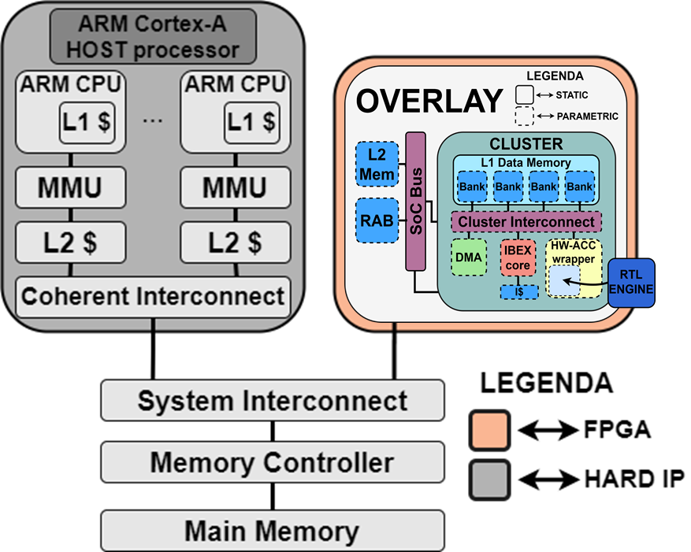

# WP3-22 – Onboard Overlay Compute Platform (OOCP)
|||
|-|-|
|ID|WP3-22|
|Contributor|UNIMORE|
|Levels|System|
|Require|Application definition and FPGA-based System-on-Chip|
|Provide|Accelerator-rich Overlay for FPGA-based System-on-Chip|
|Input|Application Specific HW Accelerators description in HDL, or HLS, or using WP3-28 Methodology|
|Output|Synthesizable Overlay for FPGA with integrated Application Specific HW Accelerators|
|C4D building block|The methodology is generic and applicable to host HW accelerators for different tasks and scenarios. With respect to C4D, it could be used to implement HW accelerators related to perception, actuation, flight-control, payload management or data management.|
|TRL|4|

  
Figure 84: Building Block diagram for WP3-22

## Detailed Description
The Onboard Overlay Compute Platform Design Methodology is composed of two main contributions:

- __Onboard Overlay Compute Platform (OOCP)__. The OOCP is an evolution of the HERO architecture targeting specifically FPGA acceleration on FPGA-based heterogeneous systems-on-chip (HeSoCs).
- __Onboard Overlay Development Kit (OODK)__. The OODK contains tools and library for the automatic integration, programming, and offloading to Application Specific Hardware Accelerators.

The __Onboard Overlay Compute Platform Design Methodology__ is generic and applicable to host accelerators for different tasks and scenarios. With respect to C4D Drone Reference Architecture, the OOCP could potentially be used to host and integrate on a FPGA-based SoC different HW accelerators (e.g., perception, actuation, flight-control, payload management or data management).

## Specifications and contribution

Increased demand of autonomy on UAV requires adequate on-board smart sensing and computing capability to support safe decision making, based on large amounts of data that is sensed, analysed and understood in real-time. The capability of flexibly defining parallel, non-Von-Neumann processing logic and custom memory hierarchies, all within contained power envelopes, makes the FPGA-based heterogeneous systems-on-chip (HeSoCs) an ideal candidate for implementing onboard compute platforms for UAV.

Withing the C4D project, we are developing an Onboard Overlay Compute Platform Design Methodology for FPGA-based HeSoCs and leverages soft-cores for flexible control of user-defined, application-specific accelerators. Different accelerators can flexibly operate and re-configure their operation without the costly need for host intervention, thus avoiding significant performance degradation. Normal accelerator operation and accelerator reconfiguration can both be achieved via standard computation offloading from the host CPU to the soft-cores (e.g., OpenMP v4.x+). The user can rely on any methodology of his/her/their choice to design the accelerators (e.g., by WP3-28 C4D components or Vivado HLS). Moreover, the Onboard Overlay Compute Platform includes dedicated logic (the wrapper) to provide plug-and-play HW/SW integration of such accelerators developed within C4D WP6 activities.

## Design and Implementation

Figure 84 shows an overview of the proposed Onboard Overlay Compute Platform (OOCP). The Onboard Overlay is based on The Parallel Ultra Low Power Platform (PULP)1, and particularly on HERO2 is an open-source research platform based on FPGA emulation of PULP-based heterogeneous many-core systems. HERO can be instantiated on FPGA SoCs like the Xilinx Zynq family.

HERO constitutes a convenient starting point to implement the Onboard Overlay Compute Platform: being conceived as a many-core architecture, HERO naturally complies with some of the basic requirements to build an accelerator-rich design, most notably the cluster-based design and the multi-bank shared memory design. However, HERO clusters are designed for general-purpose (or, at best, signal-processing oriented) parallel execution and thus have substantial limitations in the context of FPGA hardware acceleration that we target. HERO uses the FPGA merely as a medium for emulation of projects meant for IC realization.

The proposed Onboard Overlay Compute Platform uses the FPGA as a target for acceleration. For an overlay to be an efficient and convenient solution, it should offer: (i) System-level design capabilities; (ii) transparent accelerator integration flow; (iii) streamlined resource usage.

The Onboard Overlay Compute Platform is designed to be light (in terms of resources utilization) and configurable. The OOCP features a customized number of clusters, and each cluster is composed of one (or more) RISC-V IBEX 3core (RV32IMC), an instruction cache, a DMA, and a multi-ported multi-banked L1 Data Memory (scratchpad). The cluster can host one (or more) Application Specific Accelerators that can interfaced to the shared L1 Data Memory thought a wrapper.

