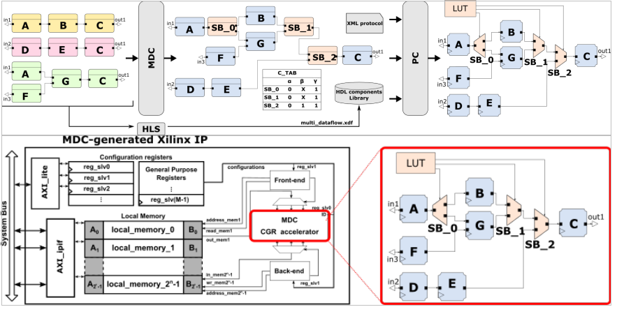

# WP3-28 – Accelerator Design Methodology for OOCP

|||
|-|-|
|ID|WP3-28|
|Contributor|UNISS|
|Levels|System|
|Require|Application definition and FPGA-based System-on-Chip|
|Provide|Ready-to-use reconfigurable HW accelerator|
|Input|Dataflow application specification(s) HDL actor definition(s) Communication protocol Target architecture|
|Output|Multi-dataflow network Coarse-grained reconfigurable accelerator RTL Co-processor RTL Programming tables|
|C4D building block|The methodology is generic and applicable to generate accelerators for different tasks and scenarios. With respect to C4D, it could POTENTIALLY be used to implement HW accelerators related to perception, actuation, flight-control, payload management or data management.|
|TRL|From 3 to 4|

  
Figure 87: Building Block diagram for WP3-28

## Detailed Description

Although FPGA technology has the potential to satisfy the many performances, energy and predictability requirements of drone systems and applications, FPGA development is notoriously a complex task.

To deal with this problematic, the baseline feature of this component revolves around the composition of coarse-grained reconfigurable HW accelerators (CGRA) starting from a set of dataflow applications. The baseline feature involves two main components:

- __Multi-Dataflow Generator (MDG)__: it merges together different dataflows into one unique reconfigurable multi-dataflow by the insertion of switching modules. Currently, two merging algorithms are supported: empiric and Moreano. The former is more suitable for non-recursive dataflows but less optimized than the latter.
- __Platform composer (PC)__: it derives the RTL description of the CGRA from the multi-dataflow. It requires the user to define the communication protocol between actors in hardware (XML) and the RTL description of the actors involved in the dataflows (HDL Components Library, HCL).

This component also provides an automatic coprocessor generation, which automatically embeds the generated CGRA into a ready-to-use Xilinx IP. The user can choose among different options:

- __Processor__: soft-core (Microblaze) or hardcore (ARM) 
- __Processor-Coprocessor coupling__: Memory-mapped or FIFO-based 
- __Direct Access Memory Module__: enable or not the usage of DMA

## Specifications and contribution

The purpose of this component is to provide a methodology to generate application-specific HW accelerators that can be directly plugged in the final system. Additionally, this component automatically enables coarse-grained reconfiguration capabilities, which enables the capability of having a HW accelerator that can work at different working points (i.e. trade-offs among Quality of Service and Energy consumption) or functionalities (i.e. different implementations related to the same C4D building block).

Regarding the contribution associated to C4D, this component will be extended to be able to automatically generate plug-and-play coarse-grained reconfigurable HW accelerators that can be used by WP3-22 component. To do so, a unified methodology will be provided so as to combine the FPGA overlay provided in WP3-22 with the CGRA generation supported by this component.

## Design and Implementation

Considering that the HW accelerators that are generated using this component are application specific, the required steps to generate the multi-dataflow networks and its associated CGRA are the following:

- Define the three inputs that are required:
    - Implement the task(s) to be accelerated using a dataflow approach.
    - Define the HDL version of the actors composing the tasks (manually or with HLS tools).
    - Define the communication protocol to be used inside and outside the accelerator. 
- Using the MDG functionality, if more than one task has been specified, merge the tasks to be accelerated into a reconfigurable multi-dataflow.
- Depending on the target architecture, the user must select the files to be generated, that could include the accelerator RTL description and a wrapping logic surrounding the accelerator itself that could allow the user to 1) use the coarse-grained reconfigurable accelerator as a co-processor or 2) to plug the accelerator with an FPGA overlay, as in the case of this project.
- Run the automatically generated scripts to port the code to Vivado.
- Synthesize and implement it on the target FPGA device.

