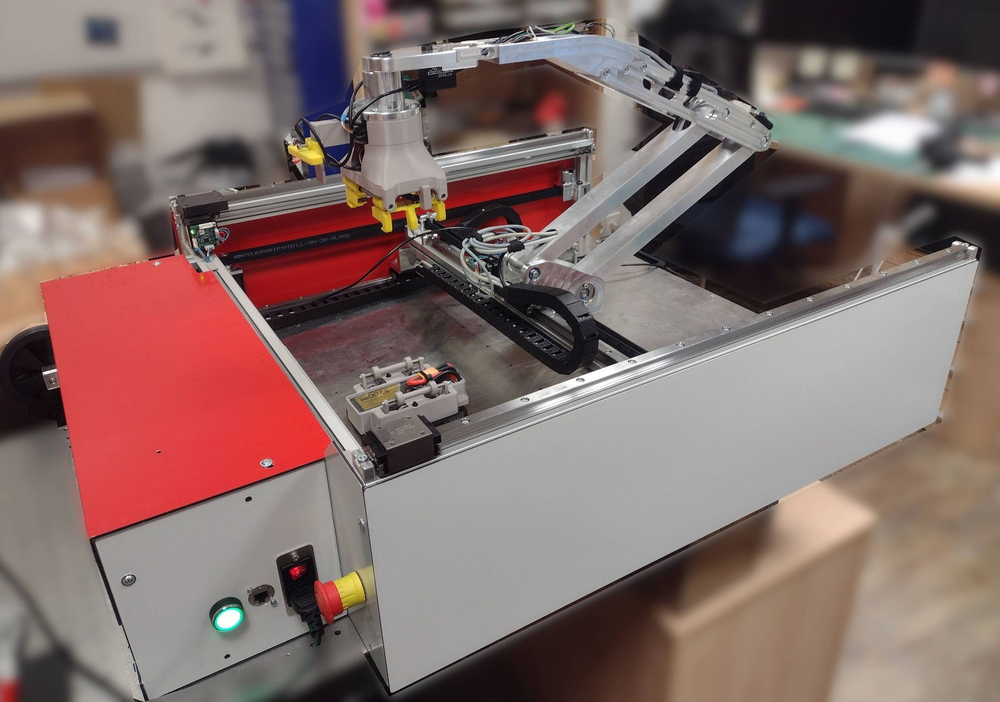
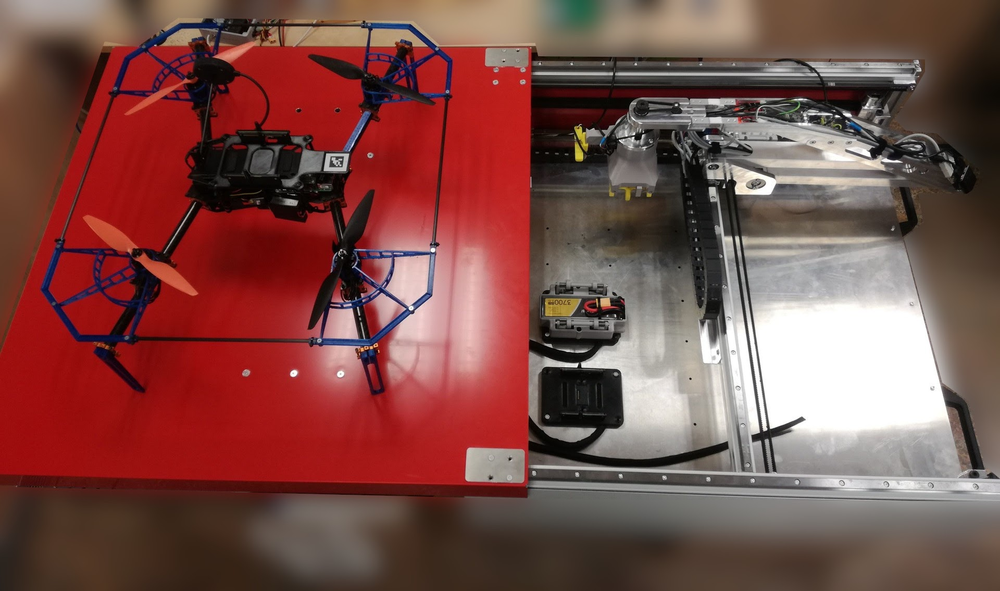

# WP3-26 Droneport: an autonomous drone battery management system

|||
|-|-|
|ID|WP3-26|
|Contributor|UWB|
|Levels|Functional|
|Require|Communication service to obtain data from the assigned drones and master controller|
|Provide|Autonomous battery management and robotic battery exchange|
|Input|UAV mission, UAV battery status|
|Output|Available battery resources|
|C4D building block|Health management, Mission management|
|TRL|4|

## Detailed Description

Droneport (DP) is a system for autonomous drone battery management. Droneport complies with a reference architecture, dealing with drone power management, more precisely battery management. Regarding the reference architecture, the DP consists of a battery management unit for charging and storage, a data link to the drone, and telemetry data.

Power and storage management building blocks are implemented in Droneport, with a datalink connection to the outside world. Users can use telemetry data via MAVLink protocol to monitor the state of the DP. The DP acts autonomously, it monitors the state of the batteries, controls the charging and battery exchange process provides necessary navigation information for drone landing and broadcasts the status of the remaining batteries.

## Contribution and Improvement

The Droneport aims to extend the UAV mission by autonomously changing the battery of the drone. It behaves as a standalone autonomous unit that is wirelessly interconnected with one or many UAVs. It is compatible with other C4D components. it uses an open MAVLink protocol with defined messages for communication. At the beginning of the project, there was only a notion of how to extend the UAVs mission. We are targeting TRL 4 (the prototype) at the end. The device would autonomously manage the batteries and cooperates with selected drones.

## Design and Implementation

  
Figure 85: Droneport manipulator arm with a custom gripper

The Droneport development is done together with SmartMotion company. Our team collaborates together on hardware and software design. The DP will be a unique device that will be able to communicate with various UAVs. For better support of battery exchange, the DP contains a newly designed gripper and a special battery holder. 
Droneport hardware consists of:

- Drone landing place with ArUco based landing markers
- Uniquely designed robotic manipulator
- Uniquely designed gripper
- Battery management unit for charging and storage
- Wireless communication to the drone/swarms

The whole device will communicate wirelessly over MAVLink protocol [29] with other devices in the network. The device is controlled using Linux based PC with REXYGEN [34] as real-time control software. 

Droneport SW architecture consists of:

- Drone to DP communication protocol (defined MAVLink messages)
- Drone landing assistant - vision navigation to ArUco markers
- Battery exchange system control - manipulator controller
- Charge control - communication interface between charges and battery slots
- Battery management software
- DP software provides an open API for interoperability with various drones flight controllers.

  
Figure 86: Top view of the Droneport with landed drone

