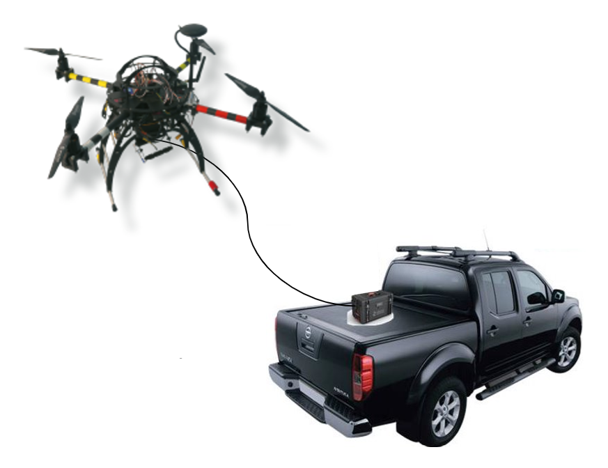

# EZ_Land Precision Landing

- __ID:__ WP4-2
- __Contributor:__ SCALIAN
- __Owner:__ SCALIAN
- __Licence:__ Proprietary
- __expected TRL:__ 5
- __KET:__ 2.3 Positioning, 2.2.1 Take-off, 2.2.2 Landing, 2.2.7 Obstacle  Detecton and Avoidance, 2.4.1 Data fusion and processing, 3.1.2 Passive Optical
- __Contact:__ david.cherel@scalian.com

The precision landing is a frequent subject for autonomous multicopter because it is an essential component for safety and autonomy in a drone system. Indeed, when relying solely on the GPS signal and IMU data, a drone can have a landing offset up to 5 meters if the signal is bad. Such an offset can be very dangerous: the drone can land on a damaged zone, risking the physical integrity of the drone, or land on a zone with human operators.

To demonstrate the efficiency of such a component, the precision landing will be deployed during the METIS use case (UC3-Demo1) to improve the safety of the system and to facilitate the operations of refill and reload of the drone when landed. It will also be deployed during the use case of ATECHSYS (UC3-Demo2) where the multicopter needs to land precisely on a droid TwinswHeel to pick up and drop off a package. Paired up with the [clearance component](../computer_vision_and_image_processing/SCALIAN-clearance.md) (human detection), the landing will be cancelled if a human is detected near the landing zone, making this component safer.

The goal of the component is to ensure a **safe**, **autonomous** and **precise landing**. 

The component of SCALIAN aims at exploiting the strength of several sensors to ensure a robust, safe and precise landing. To answer the needs of UC3-Demo1 and UC3-Demo2, the sensor IR lock and a computer vision algorithm are integrated in the component.

The visual processing algorithm is specific to a design of helipad (on the right). Aruco type markers are not used to have a more robust algorithm. Shadows and creases have a smaller impact on a refined helipad.

The component is based on a modular architecture that allows the users to configure which sensors are needed. With this conception, it is also easy to integrate a new type of sensor. It is then possible to fine tune the component to the use-case and its constraints.

## EZ_Follow - Ground target following

EZ_Follow is a mode of EZ_Land, it uses the algorithms to track and follow a ground target (the dedicated dronepad). Thanks to this mode, it is possible to build missions where a UAV take-off from a pad, follows it for a given time and lands back precisely.

We have used this mode, on a tethered UAV carrying a camera, to construct a surveillance system very easy and convenient to deploy anywhere: a vehicle carries the pad on its back with the tethered UAV ready to take-off. When arrived where the inspection is required the UAV takes-off, then the vehicle can continue to drive slowly, the UAV will follow it. During the phase, the camera operator (or security personnel) can focus only on its mission, the inspection. Indeed the UAV maintains its altitude and position relative to the vehicle. When the mission is done, the UAV lands precisely on the back of the vehicle (the precision ensures that it will not fall off), finally the vehicle can move to the next inspection area. This system is called [Long-Eye](https://www.youtube.com/watch?v=8Ae1F2ioUsM).

