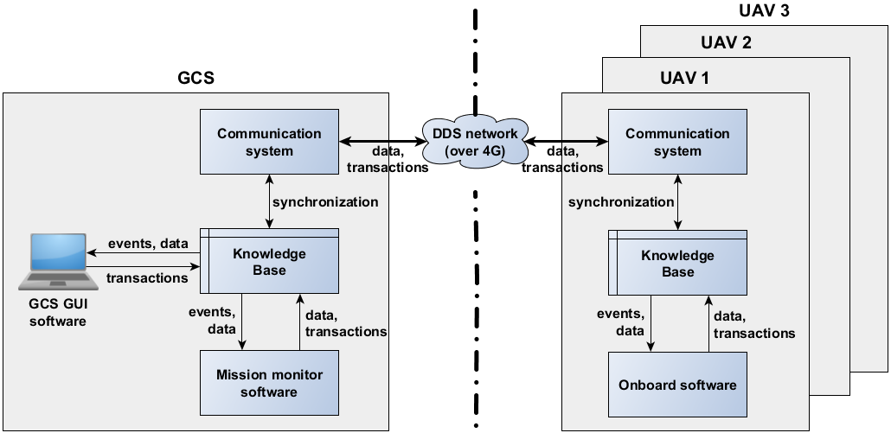

# EZ_Com Safe fleet communication

- __ID:__ WP5-03-SCALIAN
- __Contributor:__ SCALIAN
- __Owner:__ SCALIAN
- __Licence:__ Proprietary
- __expected TRL:__ 5
- __KET:__ 1.3.1 Vehicle to Vehicle communication, 1.3.2 Vehicle to Infrastructure communication, 2.5.2 Swarm formation and cooperation
- __Contact:__ david.cherel@scalian.com

: Scalian has worked on developing a [generic architecture](../Complete_UAS/SCALIAN-ez_chains.md) to allow fleet of UAVs or miscellaneous agents to perform a variety of missions. This architecture is composed of several components and a Knowledge Base whose role is to store information on the mission status and UAVs status. In a system like this, the communication system is very important to provide all the information of each agent to each other. This module is the abstraction of the communication to ensure that the agents KB are correctly sychronised.

On the hardware part of the communication system, Scalian has decided to use a 4G private network. However this solution is expensive and require operations (deployement of antenna, and so on) prior to any UAV operations.

So Scalian aims at creating a component for safe fleet communcation along two axis:

 - Use 4G public network, and setup a Virtual Private Netork (VPN) to ensure a proper level of safety and security. Additionnaly, dedicated services will be configured: e.g. video stream.
 - Replace the 4G network with a new communication mean. A solution could be a mesh network.

Both axis will be sutdied in parallel and could require to be merged into one, depending on the results obtained during the C4D project.
